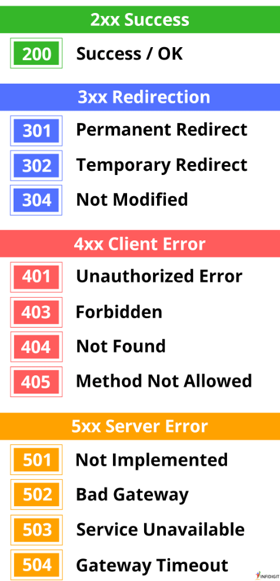
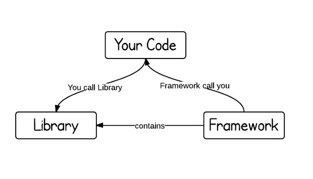
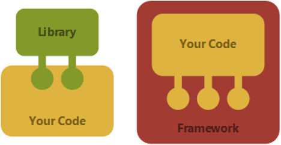

# Introduktion til 2. semester og Spring Boot
## Underviser: Signe
## Beskrivelse
### Semestret – praktisk info
Vi går igennem semesterplanen, de obligatoriske opgaver, kravene til eksamen og hvad I ellers måtte have af spørgsmål til 2. semester.

### Nye teknologier
Vi tegner i dag det store billede over de komponenter og teknologier, I kommer til at arbejde med i løbet af semesteret:

- Browser (HTML, CSS), Netværksprotokol (HTTP), Servere (Tomcat og MySQL)
- Spring Boot Web MVC Framework (Java web applikationer)
-Database med JDBC og SQL
- Github Actions (automatisering af CI/CD workflow)
- Azure (deployment af webapplikation og database i skyen)
- Github Projects
 
I forhold til 1. semester går vi fra tekstbaserede stand-alone applikationer til webapplikationer, og fra at persistere programmerne i tekstfiler til at bruge en database.

Hvad angår systemudvikling skal I stadig bruge SCRUM som udviklingsmetode, men nu ved hjælp af værktøjet Github Projects.
I skal desuden optimere og automatisere jeres udviklingsproces ud fra CI/CD principperne (Continuous Integration og Continuous Delivery)

### Spring Boot, endpoints og HTTP protokollen
Vi ser på hvad et endpoint er og laver og tester vores første endpoints i Spring Boot. Desuden skal vi snakke om HTTP protokollen og hvordan den virker.

## Forberedelse

Se disse videoer:  
 
[HTTP explained in 3 minutes](https://www.youtube.com/watch?v=KvGi-UDfy00)

[Spring Boot REST API - Getting Started | Chapter-1 ](https://www.youtube.com/watch?v=A86pk2n-u9I&list=PLpxcSt9FGVVGRjn_Hgrxl6WJv4aFUDjKE&index=1)  
[Mastering @RequestMapping Annotation in Spring Boot | Chapter-2](https://www.youtube.com/watch?v=OhRstcHvIM4&list=PLpxcSt9FGVVGRjn_Hgrxl6WJv4aFUDjKE&index=2)  
[Mastering @RequestParam Annotation: A Step-by-Step Guide | Chapter-3](https://www.youtube.com/watch?v=TJG-LTLZo5s&list=PLpxcSt9FGVVGRjn_Hgrxl6WJv4aFUDjKE&index=3)  
[@PathVariable Annotation: Everything You Need to Know | Chapter-4](https://www.youtube.com/watch?v=BVRRfmBHKSU&list=PLpxcSt9FGVVGRjn_Hgrxl6WJv4aFUDjKE&index=4)

## Læringsmål
- Forstå HTTP protokollens virkemåde
    - request og response message
    - GET og POST kommandoer
    - statuskoder
- Forstå opbygningen af en URL inkl.
    - request parametre,
    - path variable,
- Kunne lave get endpoints i Spring Boot, herunder brug af annoteringerne:
    - `@Controller` (`@RestController`)
    - `@RequestParam`
    - `@PathVariable`
- Teste endpoints i HTTP client værktøjet i IntelliJ
--- 

## Indhold
### Undervisningsform
- Vi underviser projektbaseret, dvs. at det er projekterne, der er det styrende element.
- Undervisningen er tværfaglig og dækker Programmering, Systemudvikling og Teknologi.
- Emnerne, der undervises i, vælges ud fra behovene i det aktuelle projekt. Nye emner bruges med det samme.
- Alle emner inden for Programmering, Systemudvikling og Teknologi dækkes, men undervisningens intensitet i de enkelte fagområder varierer fra uge til uge.
- Vi benytter bl.a. flipped classroom – en undervisningsstrategi, der vender den traditionelle læringsmodel på hovedet. I stedet for at modtage undervisning (f.eks. forelæsninger) i klassen og lave lektier derhjemme, tilegner man sig nyt indhold (som videoer eller læsematerialer) før undervisningen og bruger derefter klassetiden på interaktive aktiviteter, diskussioner og problemløsning med underviserens vejledning.

### Studiegrupperne
- I skal sidde sammen i studiegruppen i klasselokalet: de bliver brugt i al undervisning
- når I løser opgaver, så spørg først hinanden om hjælp i gruppen (før tutor og underviser)
- hvis I har fravær, så giv jeres studiegruppe besked
- studiegruppen opdaterer den der fx har været syg om hvad der er foregået i undervisningen

### Semesterets projekter
I skal i løbet af semesteret lave tre full-stack projekter, som vist i nedenstående tabel:

| Projekt | Bemærkninger                                                                                                                           |
|--------------------|----------------------------------------------------------------------------------------------------------------------------------------|
| Turistguide        | Består af tre delprojekter, hvor hvert enkelt delprojekt understøtter bestemte læringsmål. De fleste nye emner bliver introduceret her |
| Miniprojekt           | Scrum projekt med ét sprint                                                                                                            |
| Eksamensprojekt    | Scrum projekt med tre sprints                                                                                                          |

---
## HTTP

### URL

---
### Statuskoder

[Katte som illustrerer HTTP statuskoder](https://httpcats.com)

---
## Spring Boot

### Annotations

Styrer det der foregår "behind the scenes": fx @Controller
---

## Aktiviteter

* Indskriv jer som grupper på Teams: [A-klassen](https://erhvervsakademikbenhavn.sharepoint.com/:x:/r/sites/TeamDATA-GBG-E25AB/_layouts/15/Doc2.aspx?action=edit&sourcedoc=%7B298dffe1-b101-4743-849a-6b39b66eaca1%7D&wdOrigin=TEAMS-MAGLEV.teamsSdk_ns.rwc&wdExp=TEAMS-TREATMENT&wdhostclicktime=1769383931342&web=1) og  [B-klassen](https://erhvervsakademikbenhavn.sharepoint.com/:x:/r/sites/TeamDATA-GBG-E25AB/_layouts/15/Doc2.aspx?action=edit&sourcedoc=%7Ba51a0440-24ae-4ec4-b580-80e356a017ec%7D&wdOrigin=TEAMS-MAGLEV.teamsSdk_ns.rwc&wdExp=TEAMS-TREATMENT&wdhostclicktime=1769383900526&web=1)
    * I vælger selv hvem I vil arbejde sammen med.
    * Gruppestørrelse: 3-4

Fra i morgen kan I se i kolonnen "Check-in tider" hvornår jeres gruppe skal deltage i online check-in, som vi har hver onsdag.

Opgave 1: [Dit første Spring projekt](opgave_dit_første_spring_boot_projekt.md)

Opgave 2: [Pathvariable og requestparameter](opgave_pathvariable_og_requestparameter.md)

