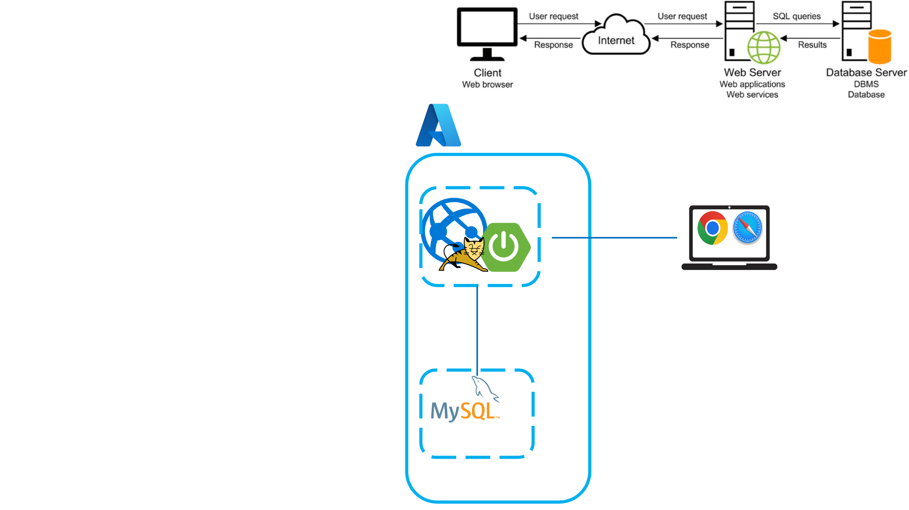
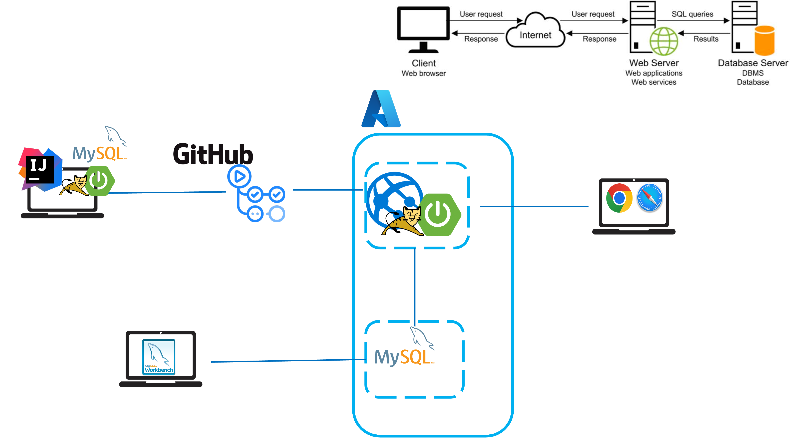

# Spring Boot arkitektur + opgaver/konsolidering af Spring Boot

## Beskrivelse

Vi kigger på arkitekturen i en Spring Boot applikation og konsoliderer vores første erfaringer med Spring Boot.

---

## Forberedelse

Se video: [Spring ultimate basics](https://youtu.be/aS9SQITRocc?si=ou9Vp0lWSMF_Lvav)

---

## Læringsmål

- At kunne forklare arkitekturen i en Spring Boot applikation
- At kunne implementere en Spring Boot applikation
- At kunne forklare Inversion of Control (IoC)
- At kunne forklare og anvende Dependency Injection (DI)

---

## Indhold

---

### En web applikation - "the big picture"



---

### En web applikation - "under development"



---

### System Oversigt

```mermaid
flowchart LR
    %% ==== Styles ====
    classDef client fill:#ffffff,stroke:#111111,stroke-width:2px
    classDef server fill:#e8c159,stroke:#a97f2f,stroke-width:2px
    classDef infra fill:#fef9c3,stroke:#a16207,stroke-width:2px
    classDef app fill:#e0f2fe,stroke:#075985,stroke-width:2px
    classDef db fill:#ffffff,stroke:#111111,stroke-width:2px

    %% ==== Nodes ====
    HTTPCLIENT["HTTP Client<br/>(Browser)"]:::client
    WEBSERVER["Web Server<br/>(Tomcat)"]:::server
    DISPATCHERSERVLET["DispatcherServlet"]:::infra
    CONTROLLER["Controller"]:::app
    SERVICE["Service"]:::app
    REPOSITORY["Repository"]:::app
    DB["Database<br/>(MySQL)"]:::db

    %% ==== Connections ====
    HTTPCLIENT --- WEBSERVER
    WEBSERVER --- DISPATCHERSERVLET
    DISPATCHERSERVLET --- CONTROLLER --- SERVICE --- REPOSITORY --- DB
```



---

###  Struktur i en Spring Boot applikation

```text
src
 └── main
     └── java
         └── com.example.demo
             ├── controller
             ├── service
             ├── repository
             └── model
```

- `controller` håndterer HTTP-forespørgsler
- `service` indeholder forretningslogik
- `repository` håndterer dataadgang
- `model` indeholder klasser der beskriver applikationes data, dvs de data der flyder imellem client og server

Det er vigtigt at alle pakker ligger under projektetes rod pakke, her: com.example.demo

---

### Spring Annotations

Spring annotations er metadata, som man sætter på klasser, metoder eller felter for at fortælle Spring-frameworket, 
hvordan koden skal behandles. De styrer, hvordan Spring opretter objekter, kobler dem sammen 
og eksponerer funktionalitet som f.eks. web-endpoints.

**Vigtige Spring annotations:**

**Stereotype annotations**
Bruges til at markere hvilken rolle en klasse har:

| Annotation         | Rolle i applikationen             | Beskrivelse                                                                 |
|--------------------|-----------------------------------|-----------------------------------------------------------------------------|
| `@Component`       | Generel Spring-komponent          | Grundlæggende annotation, der markerer en klasse som en Spring-managed bean. |
| `@RestController`  | REST API-controller              | Bruges til REST services, der returnerer JSON/XML direkte.                  |
| `@Controller`      | Web-controller (MVC)              | Bruges til web-applikationer, der returnerer views (HTML).     |
| `@Service`         | Service-lag   | Marker klasse som indeholder forretningslogik.                              |
| `@Repository`      | Dataadgangslag                   | Marker klasse som håndterer databaseadgang.                                 |


**Web annotations**
Bruges til at definere web-endpoints:

| Annotation        | Bruges til                          | Beskrivelse |
|------------------|------------------------------------|-------------|
| `@RequestMapping`| Basis-URL og HTTP-metode           | Definerer base-path og HTTP-metode for en controller eller metode. |
| `@GetMapping`    | HTTP GET                            | Håndterer GET-requests (til at hente data). |
| `@PostMapping`   | HTTP POST                           | Håndterer POST-requests (til at oprette data). |
| `@PathVariable`  | Parameter fra URL                   | Læser værdier direkte fra URL’en (fx `/users/{id}`). |
| `@RequestBody`   | JSON → Java-objekt                  | Mapper request body til et Java-objekt. |
| `@RequestParam`  | Query-parameter                     | Læser parametre fra query string (fx `?page=1`). |
| `@ResponseStatus`| HTTP statuskode                     | Sætter den HTTP-status, som metoden skal returnere. |

---

## Controller eksempel

```java
@RestController
@RequestMapping("/profiles")
public class ProfileController {

    private final ProfileService service;

    public ProfileController(ProfileService service) {
        this.service = service;
    }

    @GetMapping
    public ResponseEntity<List<Profile>> getProfiles(
            @RequestParam(required = false) String username,
            @RequestParam(required = false) String email) {

        // code not shown
    }

    @GetMapping("/{id}")
    public ResponseEntity<Profile> getProfileById(@PathVariable long id) {
        // code not shown
    }


    @PostMapping
    public ResponseEntity<Profile> createProfile(@RequestBody Profile profile) {
        // code not shown
    }
}
```

---

### Inversion of Control (IoC)

Inversion of Control (IoC) er et arkitekturprincip, hvor kontrollen over oprettelse,
livscyklus og sammensætning af objekter flyttes væk fra applikationskoden og over til et framework eller en container.

Dependency Injection er den mest almindelige måde at implementere IoC på.

---

### Dependency Injection (DI)

Dependency Injection betyder, at et objekt ikke konstruerer sine egne afhængigheder, 
men modtager dem som parametre (typisk via konstruktøren), hvilket reducerer kobling og øger fleksibilitet og
testbarhed.

---

### Opgave

---


## Aktiviteter