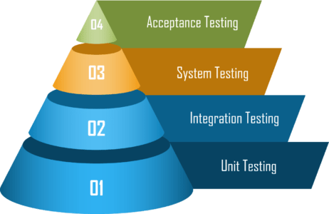
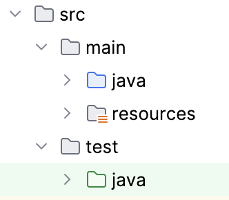
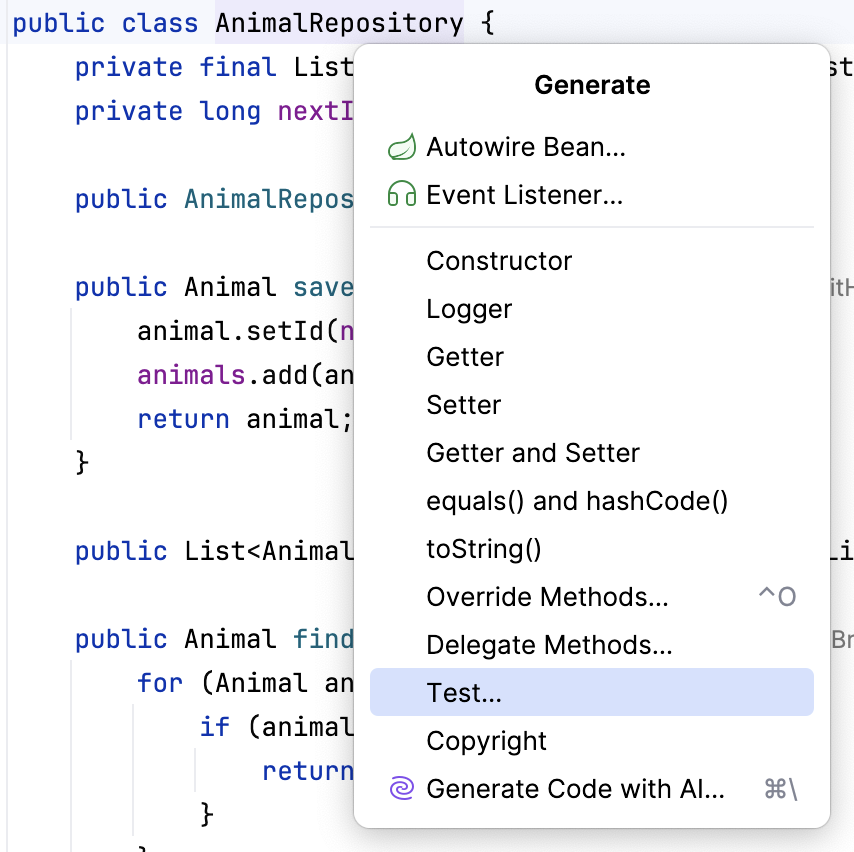
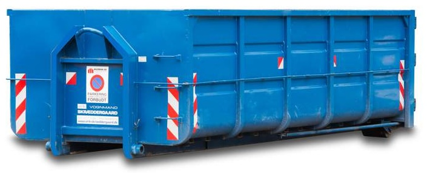
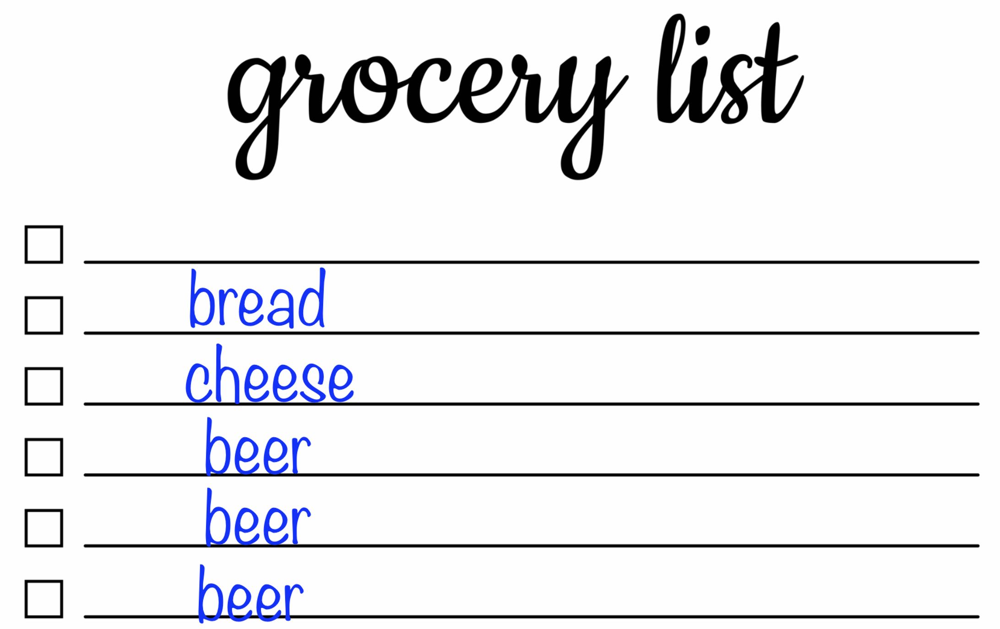
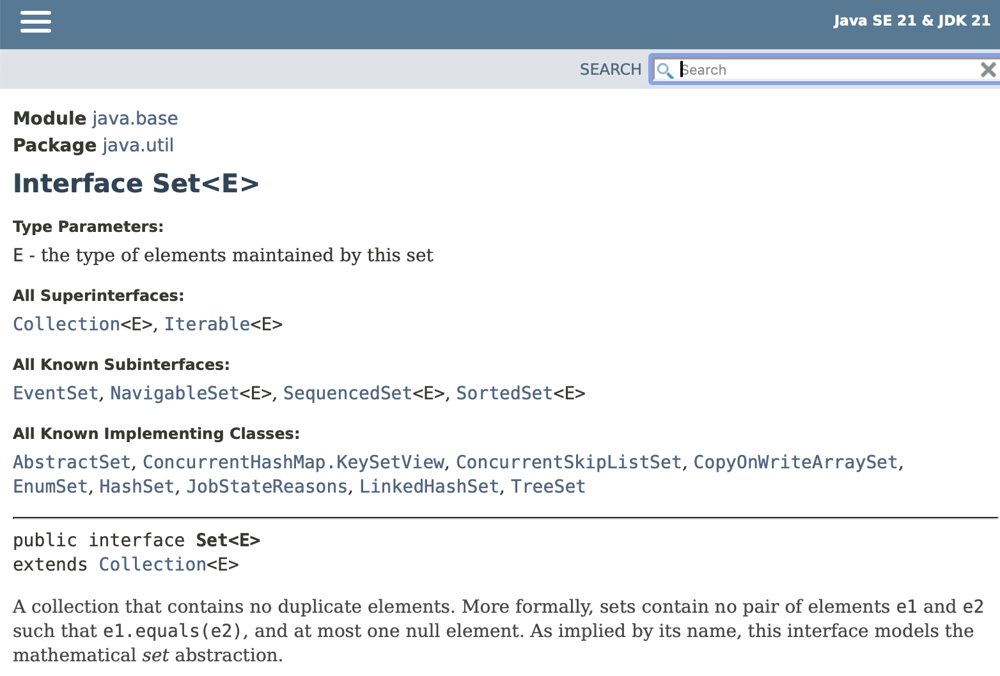
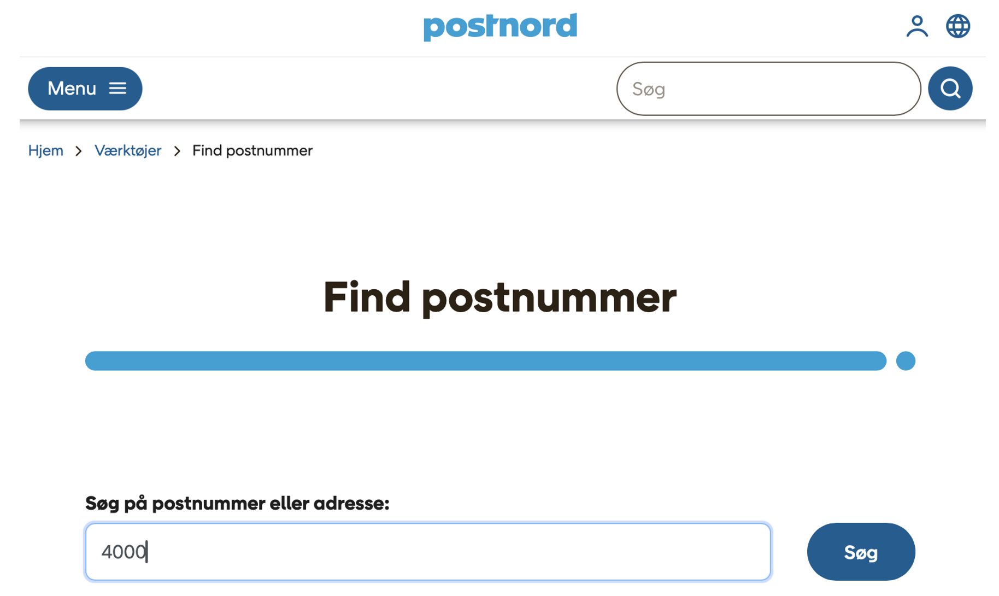
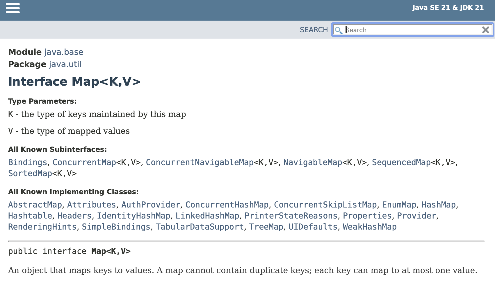

# Java Collections, Map (og unittest repetion)

## Underviser: Ian

## Beskrivelse

Vi kigger på de forskellige datatyper i Java Collection Framework, deres egenskaber og anvendelse.

Vi repeterer også unittest.

---

## Forberedelse

Læs:

[Software Quality: understanding the different types of software testing](https://www.tuleap.org/software-quality-different-types-software-testing)

[Equivalence Partitioning and Boundary Value Analysis in Software Testing](https://www.commencis.com/thoughts/unleashing-the-power-of-equivalence-partitioning-and-boundary-value-analysis-in-software-testing/)

[Getting to Know the Collection Hierarchy](https://dev.java/learn/api/collections-framework/organization/)

[Using Maps to Store Key Value Pairs](https://dev.java/learn/api/collections-framework/maps/)

---

## Læringsmål

- At kunne beskrive forskellen mellem Java Collection Framework typer som ist, Map og Set
- At kunne udvælge og anvende passende collection typer
- At kunne forklare og implementere unittest

---
## Indhold

---
### Testniveauer



### Unittest
Unit test er test af små, isolerede dele af koden (typisk én metode eller én klasse).

Formålet er:
- at finde fejl tidligt
- at gøre koden mere robust
- at give tryghed, når man ændrer eller udvider systemet

En unit test skal være:
- små og fokuseret
- isoleret/uafhængig
- hurtigt
- nem at forstå
- deterministisk (samme input → samme output)


Test metode - typisk struktur (AAA-mønster):
1.	Arrange – opsæt data og objekter
2.	Act – kald den metode der testes
3.	Assert – tjek at resultatet er korrekt

---

### Test data
Identificer input data

Definer:
- ækvivalenspartitioner/ækvivalensklasser
- gyldige (positive test)
- ugyldige input (negative test)
- grænseværdier

### Ækvivalensklasser


### Grænseværdier (Boundary value analysis)


---

### Testbar kode

- modulært
- single responsibility principle (high cohesion)
- uafhængigt (low coupling)
- anvender dependency injection
- anvender interfaces


---

### Test in IntelliJ

Når et projekt oprettes i IntelliJ, laves der automatisk en test folder.



### Oprettelse af test klasser

En test klasse kan oprettes ved at bruge [Generate](https://www.jetbrains.com/help/idea/create-tests.html) kontekstmenuen.



### Implementering af test metoder

Eksempel:

```java
class AnimalRepositoryTest {
    private AnimalRepository animalRepository;

    @BeforeEach
    void setUp() {
        animalRepository = new AnimalRepository(); // Arrange
    }

    @AfterEach
    void tearDown() {
    }

    @Test
    void findAll() {
        List<Animal> animals = animalRepository.findAll(); // Act
        assertEquals(9, animals.size()); // Assert
    }

    @Test
    void findByIdExists() {
        Animal expectedAnimal = new Animal("Freja", Species.DOG, Gender.FEMALE); // Arrange
        expectedAnimal.setId(8L); // Arrange
        Animal foundAnimal = animalRepository.findById(8); // Act
        assertEquals(expectedAnimal, foundAnimal); // Assert
    }

    @Test
    void findByIdDoesNotExist() {
        Long nonExistentId = 100L;
        assertNull(animalRepository.findById(nonExistentId));
    }

    // remaining code not shown
}
```

NB. at kunne sammenligne to objekter ved at bruge `assertEquals(expected, actual)` 
kræves at `equals()` metoden er overridden. `hashCode()`skal også være overridden.

---

### [Opgave: Unittest](opgave-movie-unittest.md)

---

### Java Collection Framework

Collections - one size fits all?



Egenskaber?



---

[Set](https://docs.oracle.com/en/java/javase/21/docs/api/java.base/java/util/Set.html)
 A collection that contains no duplicate elements.




---

Egneskaber?

<br>



---

[Map](https://docs.oracle.com/en/java/javase/21/docs/api/java.base/java/util/Map.html)
An object that maps keys to values.



---

### [Opgave: Collection framework](opgave-collections-framework.md)

---

## Aktiviteter
