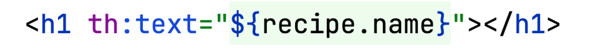

# Introduktion til Thymeleaf

## Underviser: Signe

## Beskrivelse

Vi skal se hvordan man i Spring Boot kan få genereret dynamisk HTML ved brug af server-side Java template enginen Thymeleaf.

## Forberedelse

Se denne video: [Spring Boot & Thymeleaf Tutorial (+ Bootstrap)](https://www.youtube.com/watch?v=KTBWCJPKiqk) (12 min). Bootstrap kan du bare udelade.
Prøv om du kan få eksemplet op at køre i et IntelliJ projekt på din egen maskine. Se bort fra den måde Spring Initialzr bruges på i indledningen af videoen. Du skal bruge Spring Initializr direkte i IntelliJ, som du plejer. Men husk at vælge Dependency: Spring Web og Templates engines → Thymeleaf.

Se følgende afsnit i videoen [Thymeleaf Tutorial](https://www.youtube.com/watch?v=H86eB9g1o7A&list=PLGRDMO4rOGcNhzNRdqhmrJ_RaLOtpwZiS&index=10) (ialt 20 min) på youtube:

#9 Thymeleaf Link URL Expressions

#14 Conditionals in Thymeleaf

## Læringsmål

- at kunne anvende simple Thymeleaf attributes i HTML sider
- at forstå hvordan Model-objektet fungerer i Spring Boot og Thymeleaf

## Indhold

### Hvad er Thymeleaf?

[Thymeleafs referenceside](www.thymeleaf.org)

- bruges til at generere HTML med dynamisk indhold
- template engine, der erstatter Thymeleaf variabler og udtryk, fx ${name}, på en HTML template side med Model data fra Controlleren.
- man skal huske at tilføje Thymeleaf i dependencies
- Thymeleaf er embedded i HTML tags, fx

## Aktiviteter

[Opgave 1](opgave1_thymeleafdemo.md)

[Opgave 3](opgave3_today.md)

[Opgave 4]()

