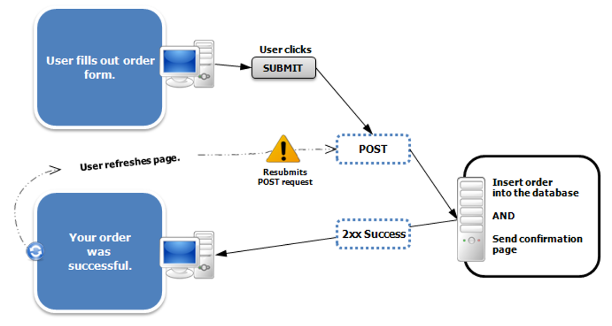
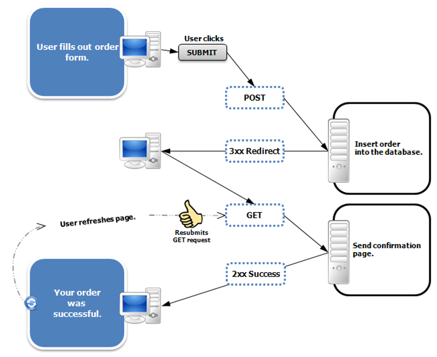

# Thymeleaf & HTML forms, Turistguide 2

## Underviser: Signe

## Beskrivelse

Vi skal arbejde med HTML forms, og I vil lære hvordan man får data fra en HTML form til en Spring Boot applikation ved brug af Thymeleaf.

I kommer til at starte på 2. del af Turistguideprojektet, som skal afleveres onsdag 25. februar.

## Forberedelse
Se afnit 9 om forms på LinkedIn Learning: [HTML Essential Training](https://www.linkedin.com/learning/html-essential-training-4/html-form-basics?resume=false&u=36836804) (13 min)

Se disse videoer om Thymeleaf og forms i [Thymeleaf Tutorial](https://www.youtube.com/watch?v=510O21xeelY&list=PLGRDMO4rOGcNhzNRdqhmrJ_RaLOtpwZiS&index=17) (30 min) på youtube:

#17 Create Handler Method to Return Register Page

#18 Design User Registration Form

#19 Submit Form and Display User Registration Form Data

## Læringsmål
- at kunne anvende HTML forms med Thymeleaf
- at forstå annotationen @ModelAttribute
- at kunne håndtere response/redirect i controlleren

## Indhold

### Redirect-pattern

#### Problemet

#### Løsningen

