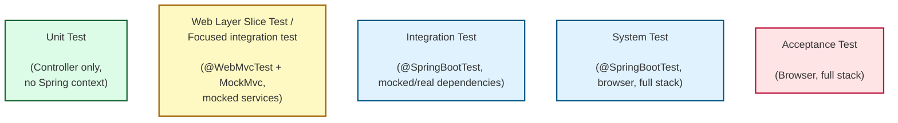
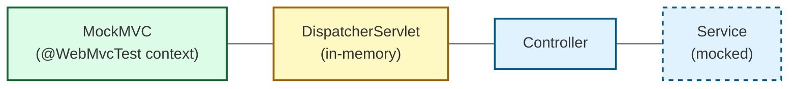

## MockMVC, Mockito og test af Controller

---

## Underviser: Ian

---

## Beskrivelse

Vi skal se på forskellige slags test, og specifikt på test af controlleren.

---

## Forberedelse

Læs:

[How to Test Spring Boot Web Controller the Right Way](https://rieckpil.de/how-to-test-spring-boot-web-controller-the-right-way/)

---
## Læringsmål
- At kunne forklare de forskellige testniveauer
- At kunne forklare mocking
- At kunne anvende MockMVC testværktøj
- At kunne anvende Mockito framework
- At kunne skrive tests af Controller klasser

---
## Indhold
- Forberedelsen (Parvis: kommentarer og spørgsmål)
- Testniveauer
- MockMVC, @WebMVCTest
- Mockito
- Test af controllere
- Web layer slice / "Focused" integration test af controller
- Opgave: [Web layer slice test](opgave-weblayer-slice-test.md)
- Opgave: [Forklar test begreberne](opgave-forklar-test-begreberne.md)
- Opgave: [Turistguide controller test (weblag)](opgave-turistguide-controller-weblag-tests.md)
---
### Testniveauer

©️tuleap.org


---
### System Oversigt

```mermaid
flowchart LR
    %% ==== Styles ====
    classDef client fill:#ffffff,stroke:#111111,stroke-width:2px
    classDef server fill:#e8c159,stroke:#a97f2f,stroke-width:2px
    classDef infra fill:#fef9c3,stroke:#a16207,stroke-width:2px
    classDef app fill:#e0f2fe,stroke:#075985,stroke-width:2px
    classDef db fill:#ffffff,stroke:#111111,stroke-width:2px

    %% ==== Nodes ====
    HTTPCLIENT["HTTP Client<br/>(Browser)"]:::client
    WEBSERVER["Web Server<br/>(Tomcat)"]:::server
    DISPATCHERSERVLET["DispatcherServlet"]:::infra
    CONTROLLER["Controller"]:::app
    SERVICE["Service"]:::app
    REPOSITORY["Repository"]:::app
    DB["Database<br/>(MySQL)"]:::db

    %% ==== Connections ====
    HTTPCLIENT --- WEBSERVER
    WEBSERVER --- DISPATCHERSERVLET
    DISPATCHERSERVLET --- CONTROLLER --- SERVICE --- REPOSITORY --- DB
```


---
### Test af Controller
- Der er forskellige niveauer af test, der kan udføres på en controller i en Spring Boot-applikation.

- Unit test verificerer en enkelt klasse eller metode i isolation, typisk med alle afhængigheder mocket.
- Web layer slice test verificerer en controller ved at starte en minimal Spring-kontekst med @WebMvcTest og mocke de underliggende servicelag.
- Integrationstest verificerer samspillet mellem flere lag eller komponenter.
- Systemtest verificerer hele systemet som en samlet applikation i et realistisk miljø, typisk med alle lag og eksterne integrationer uden mocks.
- Acceptance / End-to-end test verificerer hele applikationen fra klient til database i et miljø, der simulerer den virkelige driftssituation.

---

### Web slice test (focused integration test) af Controller
- For at kunne teste en controller isoleret (web layer slice test) skal der mockes/simuleres http forespørelser og andre dependencies dvs. service laget


---
### Mocking

- Mocking er at erstatte en afhængighed med et simuleret objekt, som returnerer kontrollerede værdier i en test sammenhæng
- Mocking gør det muligt at isolere den kode, som skal testes, og simulere dens omgivelser på en kontrolleret måde
- En mock kan returnere værdier og verificere, at bestemte kald er sket
---
### MockMVC

- MockMVC er en klasse i Spring test framework, der bruges til at teste web-laget (controller-laget) i en Spring Boot-applikation.
- Med MockMVC kan man simulere HTTP-forespørgsler til Spring MVC-controllere og verificere, hvordan controlleren håndterer dem.
- MockMVC skaber simulerede HTTP-forespørgsler uden at starte en rigtig webserver.

```java
class HelloControllerTest {

    @Autowired
    private MockMvc mockMvc;

    //rest of the test code not shown
```

Simulere HTTP GET forespørgsel og teste responsen

```java
        mockMvc.perform(get("/hello"))
                .andExpect(status().isOk())
                .andExpect(view().name("hello"))
                .andExpect(model().attributeExists("profile"))
                .andExpect(model().attribute("message","Hello Joe (joe@example.com)"));
```

[MockMvc API](https://docs.spring.io/spring-framework/docs/current/javadoc-api/org/springframework/test/web/servlet/MockMvc.html)

---
### `@WebMVCTest`

- @WebMvcTest er en Spring Boot test-annotation, der bruges til at teste web-laget (controllerer)
- @WebMvcTest bruges ofte med MockMVC for at simulere HTTP-anmodninger uden at starte en rigtig server
- Loader kun web-laget (f.eks. DispatcherServlet, controllere, konfiguration af Spring MVC), men ikke services eller repositories

```java
@WebMvcTest(ProfileController.class) // only load the web layer
class ProfileControllerTest {

    @Autowired
    private MockMvc mockMvc; // use MockMVC for testing web layer

  //rest of the test code not shown

}
  ```
---
### `@MockitoBean`
- Når man kun ønske at teste web-laget, skal de underliggende services mockes
- `@MockitoBean` er en Spring Boot test-annotation, der bruges til at oprette og injicere en Mockito mock
(i stedet for den rigitige Bean).

```java
@WebMvcTest(ProfileController.class)
class ProfileControllerTest {

    @Autowired
    private MockMvc mockMvc;

    @MockitoBean
    private ProfileService profileService; // mock created and injected here
```


---
### Mockito

[Mockito](https://site.mockito.org) er et Java bibliotek, der bruges til test.
Det gør det muligt at erstatte afhængigheder med mocks,
konfigurere deres metoder til at returnere bestemte værdier,
og kontrollere om de blev kaldt som forventet.

Mockitos `when-thenReturn` syntaks:

```java
@Test
void get_hello_returns_HelloView_withProfileAndMessage() throws Exception {
    // Tell mock service what to return
    when(profileService.getGreetingMessage()).thenReturn("Hello Joe (j@test.com)");
        
        // rest of test code not shown
```


Mockitos `verify` metode:

```java
@Test
void get_hello_returns_HelloView_withProfileAndMessage() throws Exception {
    when(profileService.getGreetingMessage()).thenReturn("Hello Joe (j@test.com)");

    mockMvc.perform(get("/hello"))
            .andExpect(status().isOk())
            .andExpect(view().name("hello"))
            .andExpect(model().attributeExists("profile"))
            .andExpect(model().attribute("message","Hello Joe (j@test.com)"));

    verify(profileService).getGreetingMessage();
}
```


---

Ved test af POST metoder, kan man bruge `verify` til at kontrollere, 
at en bestemt metode blev kaldt med bestemte parametre.

Med Springs ArgumentCaptor tester man, at:
- Spring MVC binder form-parametre korrekt til objektet
- Controlleren sender det korrekte Profile videre til service-laget
- POST-requesten virker som forventet

```java
    @Test
    void post_hello_savesProfile_andRedirects() throws Exception {
        mockMvc.perform(post("/hello")
                        .contentType("application/x-www-form-urlencoded")
                        .param("name", "Jane")
                        .param("email", "jj@test.com"))
                .andExpect(status().is3xxRedirection())
                .andExpect(redirectedUrl("/hello"));

        // verify that save is called with the correct profile
        ArgumentCaptor<Profile> captor = ArgumentCaptor.forClass(Profile.class);
        verify(profileService).save(captor.capture());

        Profile saved = captor.getValue();
        assertEquals("Jane", saved.getName());
        assertEquals("jj@test.com", saved.getEmail());
    }
```


___

## Aktiviteter

Lav følgende opgaver
- [Web layer slice test](opgave-weblayer-slice-test.md)
- [Forklar test begreberne](opgave-forklar-test-begreberne.md)
- [Turistguide controller test (weblag)](opgave-turistguide-controller-weblag-tests.md)

---
