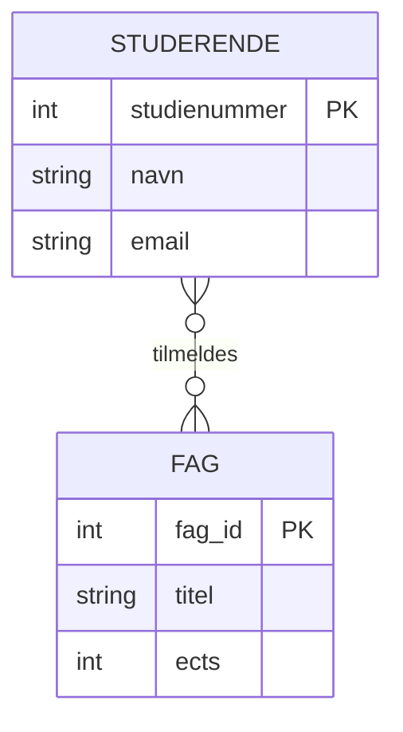
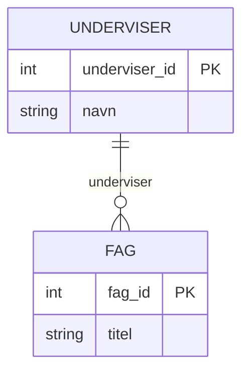
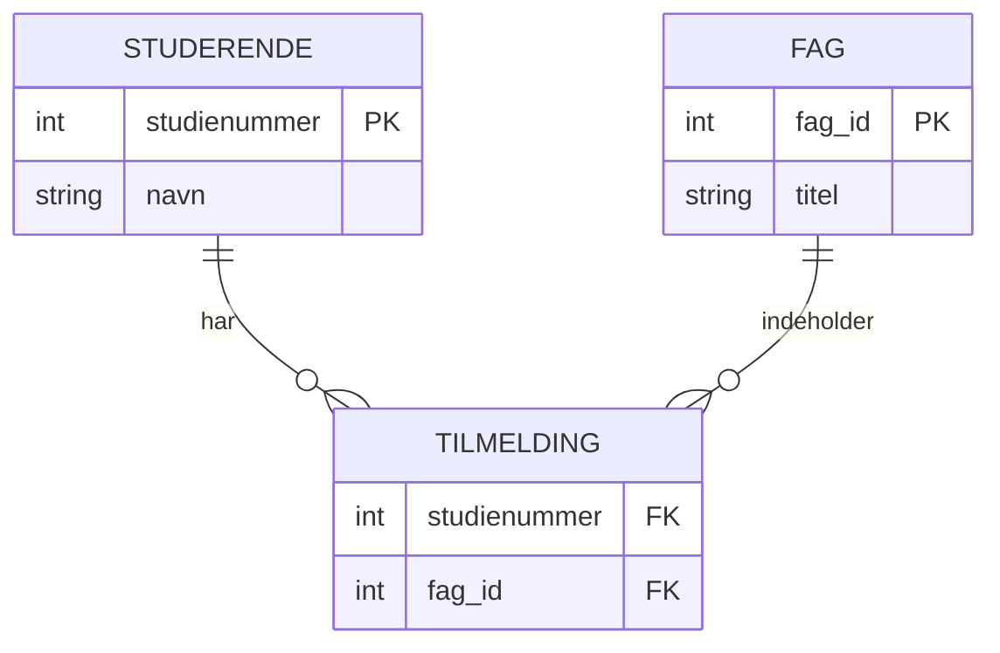
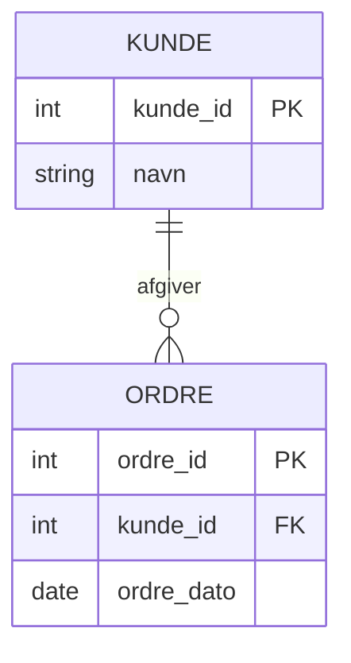

# E/R model og relationel model

## Beskrivelse  
I dag skal vi se på hvad en relationel database er og hvordan vi modellerer data vha E/R diagrammer


## Forberedelse
Se disse videoer:  
[What Is a Relational Database? | Beginner’s Guide](https://www.youtube.com/watch?v=zDNAOM6Mx4E)  (til 6:30)  
[Entity Relationship Diagram (ERD) Tutorial - Part 1](https://www.youtube.com/watch?v=xsg9BDiwiJE)  
[Entity Relationship Diagram (ERD) Tutorial - Part 2: Primary keys, foreign keys, and bridge tables](https://www.youtube.com/watch?v=hktyW5Lp0Vo)  

Resourcer:  
[What is Entity Relationship Diagram (ERD)?](https://www.visual-paradigm.com/guide/data-modeling/what-is-entity-relationship-diagram/)  
[Understanding Crow's Foot Notation: Symbols & Usage Guide](https://creately.com/guides/crows-foot-notation/)  

Værktøjer:  
[Visual Paradigm](https://online.visual-paradigm.com/)  
[Lucid Chart](https://lucid.app/)  
[Diagrams.net](https://app.diagrams.net/)

## Læringsmål
- kan forklare hvordan en relationel database er opbygget
- Kan designe en datamodel vha. ER modellering
- Kan identificere tabeller, kolonner, nøgler, og relationer ml. tabeller ud fra en E/R model.  

## Indhold
I dette undervisningsforløb arbejder vi med modellering af data, som er et centralt fundament for al backend-udvikling og databasesystemer. Fokus er på sammenhængen mellem virkelighed → model → database.

Vi starter med E/R-modeller (Entity/Relationship) som et konceptuelt værktøj, og bevæger os videre til den relationelle databasemodel, som er den struktur, vi rent faktisk implementerer i en SQL-database (fx MySQL).

### Fra domæne til datamodel

Når man designer en database, starter man ikke med tabeller – man starter med domænet:

Hvilke begreber findes der i problemet, og hvordan hænger de sammen?

Eksempel (simpelt studieadministrativt domæne):
- Studerende
- Fag
- Underviser
- Tilmelding

Disse begreber modelleres først som entiteter og relationer i en E/R-model.

### E/R-modellen (Entity / Relationship)
En E/R-model beskriver:
- Entiteter (fx Studerende, Fag)
- Attributter (fx studienummer, navn)
- Relationer mellem entiteter
- Kardinalitet (1-1, 1-mange, mange-mange)

Eksempel: Studerende og Fag


Fortolkning:
- En studerende kan være tilmeldt mange fag
- Et fag kan have mange studerende
- Relationstypen er mange-til-mange

#### Kardinalitet og optionalitet

E/R-modeller gør det tydeligt:

- hvor mange instanser der kan deltage i en relation
- om relationen er obligatorisk eller valgfri

Eksempel: Underviser og Fag

Her betyder det:
- Et fag skal have præcis én underviser
- En underviser kan undervise i flere fag

#### Fra E/R-model til relationel databasemodel
Når E/R-modellen er på plads, oversættes den til den relationelle model, dvs.:

- tabeller
- primærnøgler
- fremmednøgler

Entiteter → tabeller:
```
STUDERENDE(studienummer PK, navn, email)
FAG(fag_id PK, titel, ects)
```
Mange-til-mange → forbindelsestabel

Relationen Studerende–Fag kræver en join-tabel:  
```
TILMELDING(
    studienummer FK → STUDERENDE,
    fag_id FK → FAG,
    PRIMARY KEY (studienummer, fag_id)
)
```
Visualiseret:  

I den relationelle model er nøgler helt centrale:


#### Primærnøgler og fremmednøgler
- Primærnøgle (PK)
Identificerer entydigt en række i en tabel

- Fremmednøgle (FK)
Skaber relationer mellem tabeller og sikrer referentiel integritet

Eksempel:

Her ligger kunde_id som FK i ORDRE-tabellen.


## Aktiviteter


