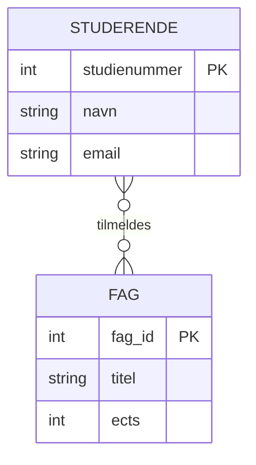
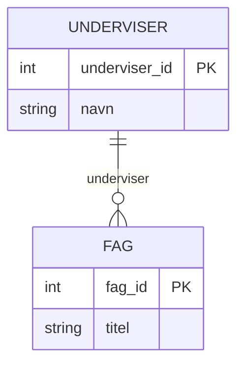
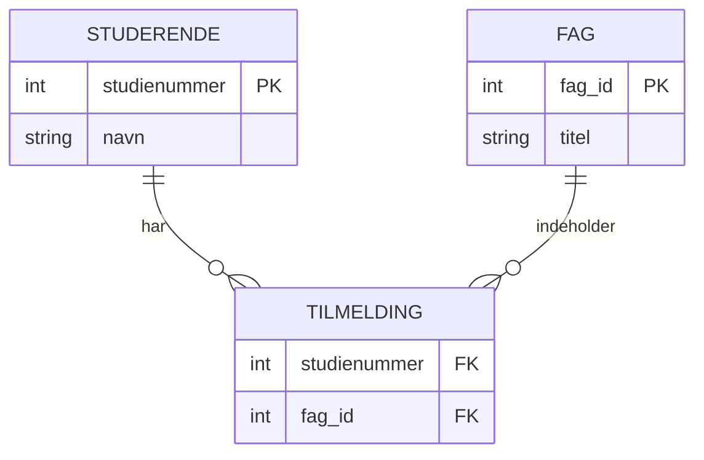
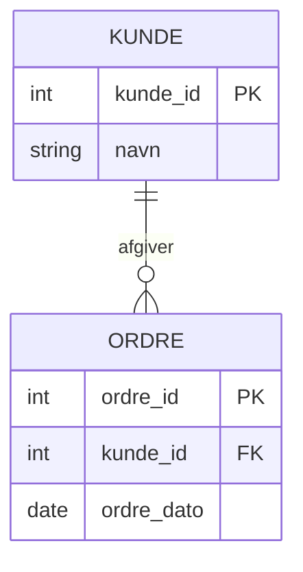
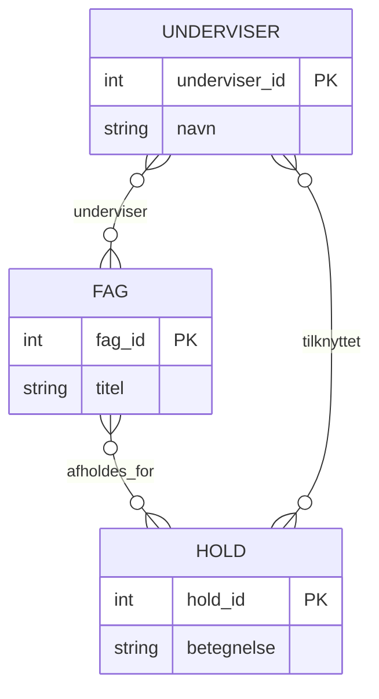
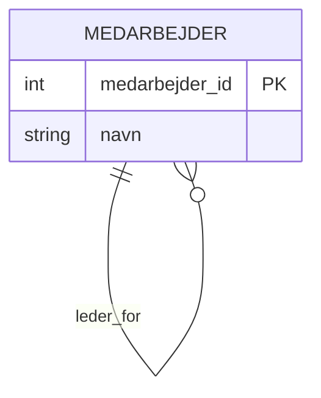
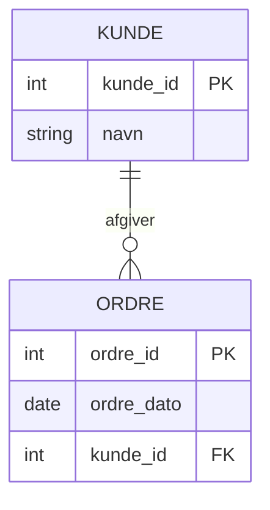
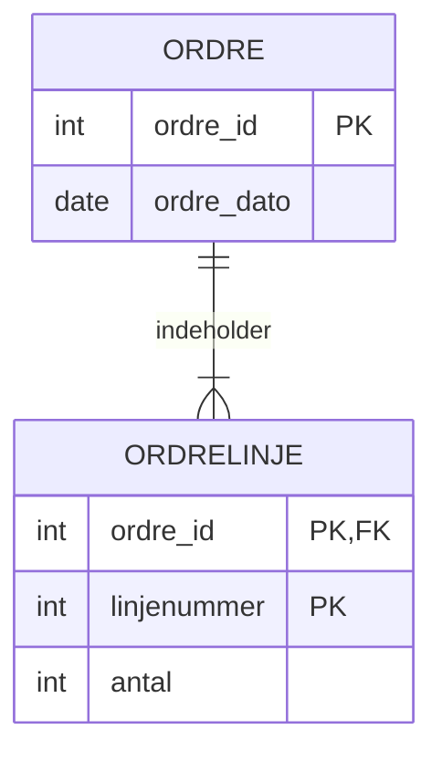

# E/R model og relationel model

## Beskrivelse  
I dag skal vi se på hvad en relationel database er og hvordan vi modellerer data vha E/R diagrammer


## Forberedelse
Se disse videoer:  
[What Is a Relational Database? | Beginner’s Guide](https://www.youtube.com/watch?v=zDNAOM6Mx4E)  (til 6:30)  
[Entity Relationship Diagram (ERD) Tutorial - Part 1](https://www.youtube.com/watch?v=xsg9BDiwiJE)  
[Entity Relationship Diagram (ERD) Tutorial - Part 2: Primary keys, foreign keys, and bridge tables](https://www.youtube.com/watch?v=hktyW5Lp0Vo)  

Resourcer:  
[What is Entity Relationship Diagram (ERD)?](https://www.visual-paradigm.com/guide/data-modeling/what-is-entity-relationship-diagram/)  
[Understanding Crow's Foot Notation: Symbols & Usage Guide](https://creately.com/guides/crows-foot-notation/)  

Værktøjer:  
[Visual Paradigm](https://online.visual-paradigm.com/)  
[Lucid Chart](https://lucid.app/)  
[Diagrams.net](https://app.diagrams.net/)

## Læringsmål
- kan forklare hvordan en relationel database er opbygget
- Kan designe en datamodel vha. ER modellering
- Kan identificere tabeller, kolonner, nøgler, og relationer ml. tabeller ud fra en E/R model.  

## Indhold
I dette undervisningsforløb arbejder vi med modellering af data, som er et centralt fundament for al backend-udvikling og databasesystemer. Fokus er på sammenhængen mellem virkelighed → model → database.

Vi starter med E/R-modeller (Entity/Relationship) som et konceptuelt værktøj, og bevæger os videre til den relationelle databasemodel, som er den struktur, vi rent faktisk implementerer i en SQL-database (fx MySQL).

### Fra domæne til datamodel

Når man designer en database, starter man ikke med tabeller – man starter med domænet:

Hvilke begreber findes der i problemet, og hvordan hænger de sammen?

Eksempel (simpelt studieadministrativt domæne):
- Studerende
- Fag
- Underviser
- Tilmelding

Disse begreber modelleres først som entiteter og relationer i en E/R-model.

### E/R-modellen (Entity / Relationship)
En E/R-model beskriver:
- Entiteter (fx Studerende, Fag)
- Attributter (fx studienummer, navn)
- Relationer mellem entiteter
- Kardinalitet (1-1, 1-mange, mange-mange)

Eksempel: Studerende og Fag


Fortolkning:
- En studerende kan være tilmeldt mange fag
- Et fag kan have mange studerende
- Relationstypen er mange-til-mange

#### Kardinalitet og optionalitet

E/R-modeller gør det tydeligt:

- hvor mange instanser der kan deltage i en relation
- om relationen er obligatorisk eller valgfri

Eksempel: Underviser og Fag

Her betyder det:
- Et fag skal have præcis én underviser
- En underviser kan undervise i flere fag

#### Fra E/R-model til relationel databasemodel
Når E/R-modellen er på plads, oversættes den til den relationelle model, dvs.:

- tabeller
- primærnøgler
- fremmednøgler

Entiteter → tabeller:
```
STUDERENDE(studienummer PK, navn, email)
FAG(fag_id PK, titel, ects)
```
Mange-til-mange → forbindelsestabel

Relationen Studerende–Fag kræver en join-tabel:  
```
TILMELDING(
    studienummer FK → STUDERENDE,
    fag_id FK → FAG,
    PRIMARY KEY (studienummer, fag_id)
)
```
Visualiseret:  

I den relationelle model er nøgler helt centrale:


#### Primærnøgler og fremmednøgler
- Primærnøgle (PK)
Identificerer entydigt en række i en tabel

- Fremmednøgle (FK)
Skaber relationer mellem tabeller og sikrer referentiel integritet

Eksempel:

Her ligger kunde_id som FK i ORDRE-tabellen.

#### Ternære relationer

En ternær relation er en relation, der involverer tre entiteter på samme tid.
De kan ikke altid reduceres korrekt til flere binære relationer uden at miste betydning.

Ternære relationer opstår typisk, når:
- en hændelse involverer flere aktører
- relationen har sin egen semantik (fx tidspunkt, rolle, ansvar)

Eksempel: Underviser tildeler fag til hold

I dette eksempel:

"en underviser underviser et fag for et bestemt hold"



I praksis vil en korrekt relationel model ofte kræve en forbindelsestabel, fx:
UNDERVISNING(underviser_id, fag_id, hold_id)

Her giver det kun mening, at alle tre nøgler eksisterer samtidig.

#### Rekursive relationer

En rekursiv relation er en relation, hvor en entitet er relateret til sig selv.

Det bruges, når objekter i samme tabel kan have:

- hierarkier
- forældre/barn-forhold
- afhængigheder

Eksempel: Medarbejder som leder for medarbejdere


Fortolkning:

- En medarbejder kan være leder for mange medarbejdere
- En medarbejder kan have én leder
- Relationens fremmednøgle peger tilbage på samme tabel

Relationel implementering:
MEDARBEJDER(
    medarbejder_id PK,
    navn,
    leder_id FK → MEDARBEJDER.medarbejder_id
)

### Identifying vs. non-identifying relations

Denne skelnen er vigtig for at forstå, hvordan primærnøgler dannes i relationelle databaser.

Non-identifying relation:

En non-identifying relation betyder, at:

- barnets primærnøgle ikke afhænger af forælderens nøgle
- fremmednøglen er ikke en del af PK

Eksempel: Kunde og Ordre

Her:
- ordre_id identificerer ordren alene
- kunde_id er kun en fremmednøgle

#### Identifying relation

En identifying relation betyder, at:

- barnets eksistens afhænger af forælderen
- barnets primærnøgle indeholder forælderens nøgle

Eksempel: Ordre og Ordrelinje


Her:

- ORDRELINJE kan ikke eksistere uden ORDRE
- primærnøglen består af (ordre_id, linjenummer)


## Aktiviteter


