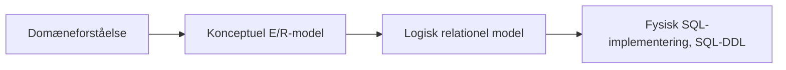
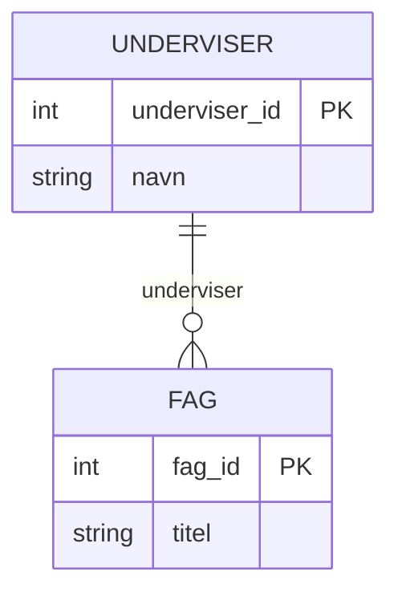
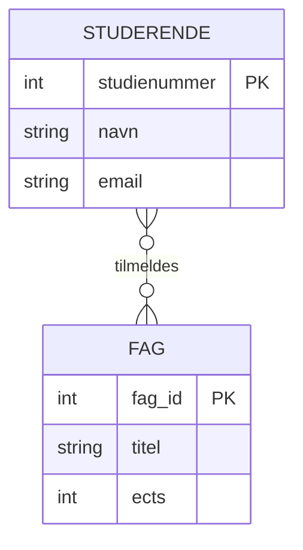
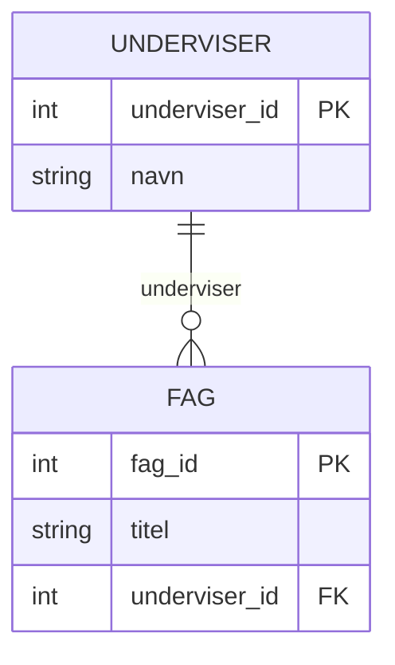
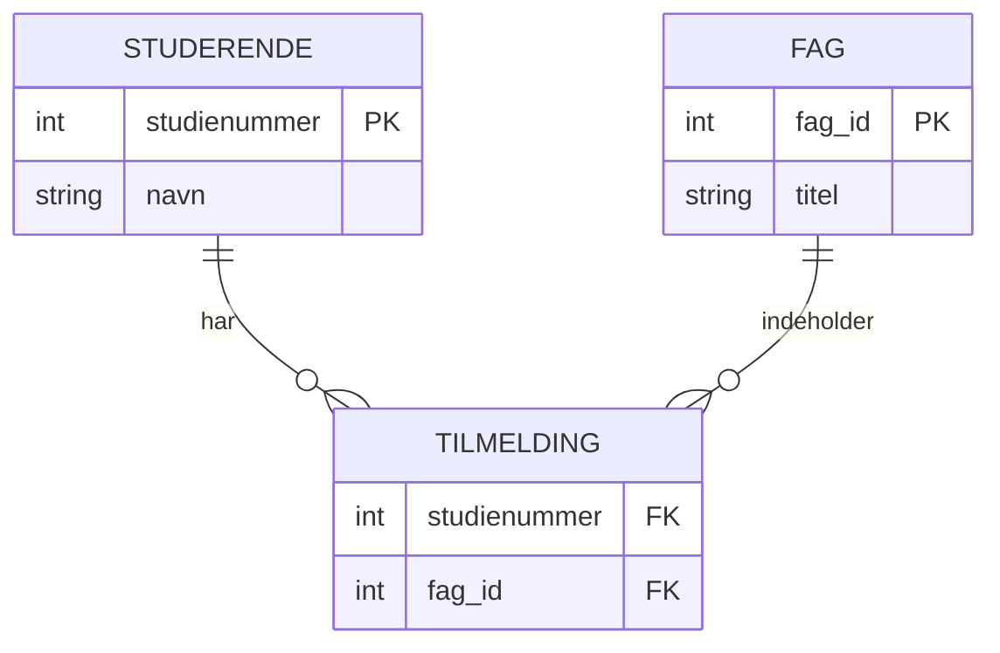
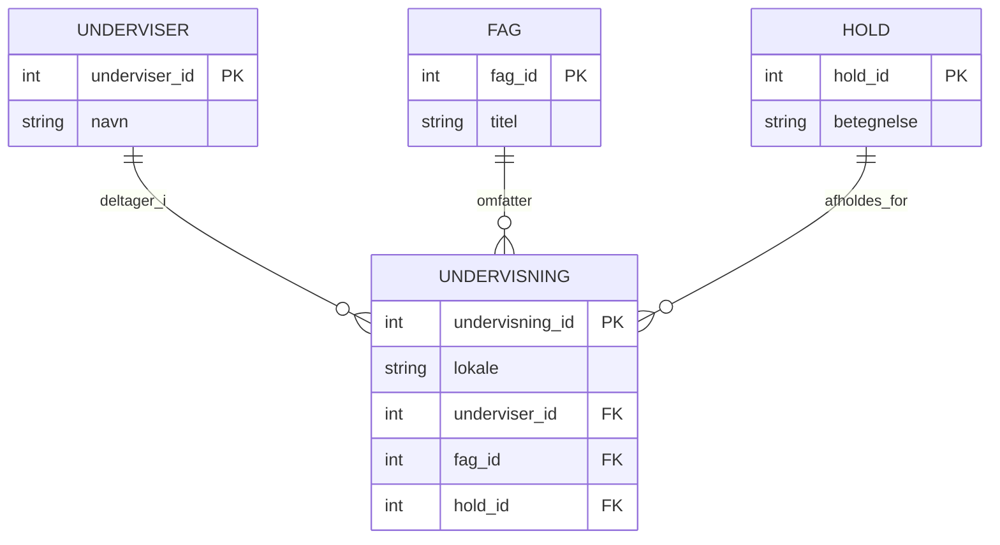
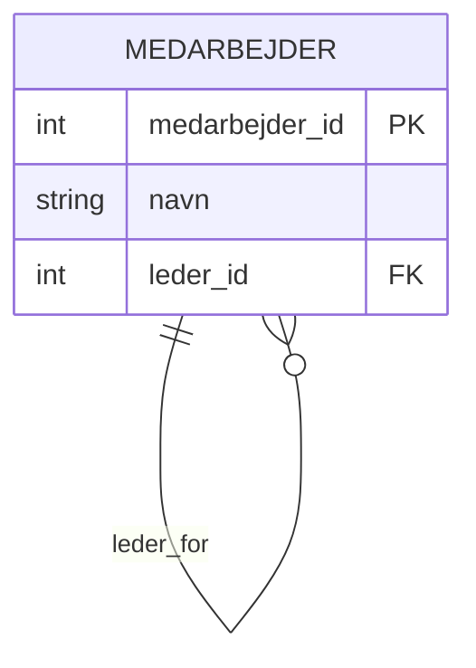
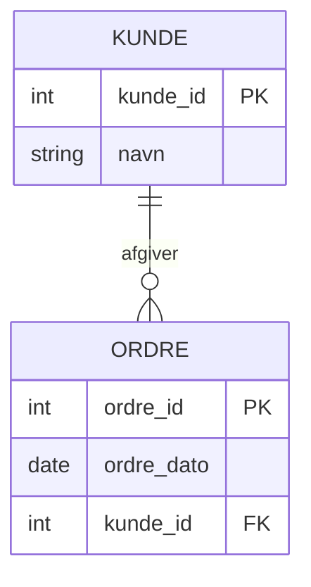
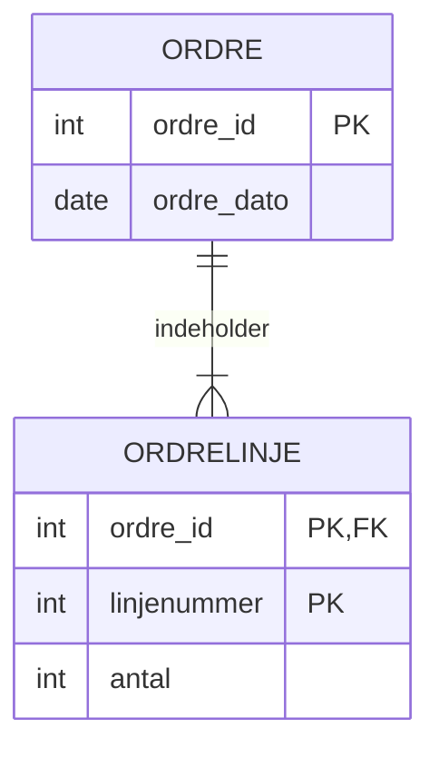

# E/R model og relationel model

## Beskrivelse  
I dag skal vi se på hvad en relationel database er og hvordan vi modellerer data vha E/R diagrammer


## Forberedelse
Se disse videoer:  
[What Is a Relational Database? | Beginner’s Guide](https://www.youtube.com/watch?v=zDNAOM6Mx4E)  (til 6:30)  
[Entity Relationship Diagram (ERD) Tutorial - Part 1](https://www.youtube.com/watch?v=xsg9BDiwiJE)  
[Entity Relationship Diagram (ERD) Tutorial - Part 2: Primary keys, foreign keys, and bridge tables](https://www.youtube.com/watch?v=hktyW5Lp0Vo)  

Resourcer:  
[What is Entity Relationship Diagram (ERD)?](https://www.visual-paradigm.com/guide/data-modeling/what-is-entity-relationship-diagram/)  
[Understanding Crow's Foot Notation: Symbols & Usage Guide](https://creately.com/guides/crows-foot-notation/)  

Værktøjer:  
[Visual Paradigm](https://online.visual-paradigm.com/)  
[Lucid Chart](https://lucid.app/)  
[Diagrams.net](https://app.diagrams.net/)

## Læringsmål
- kan forklare trin i datamodelleringsprocessen, fra konceptuel model til fysisk design
- Kan designe en datamodel vha. E/R modellering
- Kan ovesrsætte en konceptuel E/R datamodel til en logisk relationel datamodel med tabeller, kolonner, nøgler, og relationer ml. tabeller  

## Indhold
I dette dag arbejder vi med modellering af data, som er et centralt fundament for al backend-udvikling og databasesystemer. Fokus er på sammenhængen mellem virkelighed → model → database.

Vi starter med E/R-modeller (Entity/Relationship) som et konceptuelt værktøj, og bevæger os videre til den relationelle databasemodel, som er den struktur, vi rent faktisk implementerer i en SQL-database (fx MySQL) ved anvendelse af SQL DDL.    
En samlet oversigt over processen er vist nedenfor:  


### Fra domæne til datamodel

Når man designer en database, starter man ikke med tabeller – man starter med domænet:

Hvilke begreber findes der i problemet, og hvordan hænger de sammen?

Eksempel (simpelt studieadministrativt domæne):
- Studerende
- Fag
- Underviser
- Tilmelding

Disse begreber modelleres først som entiteter og relationer i en konceptuel E/R-model.

### Konceptuel E/R-model
En konceptuel E/R-model beskriver:
- Entiteter
- Attributter
- Relationer mellem entiteter
- Kardinalitet (1-1, 1-mange, mange-mange)

**Eksempel: Underviser og Fag**

Fortolkning:  
- En underviser kan undervise i flere fag  
- Et fag skal have præcis én underviser
- Relationstypen er 1-til-mange

Kardinaliteten vises ved brug af [crows foot notation](https://creately.com/guides/crows-foot-notation/)

**Eksempel: Studerende og Fag**


Fortolkning:
- En studerende kan være tilmeldt mange fag
- Et fag kan have mange studerende
- Relationstypen er mange-til-mange

#### Kardinalitet og optionalitet

E/R-modeller gør det tydeligt:

- hvor mange instanser der kan deltage i en relation
- om relationen er obligatorisk eller valgfri


### Logisk relationel model
Når E/R-modellen er på plads, oversættes den til den relationelle model, dvs.:

- tabeller
- primærnøgler
- fremmednøgler

**Eksempel: Underviser og Fag**  
Nu handler det om hvordan data lagres relationelt. Vi indfører en fremmednøgle på "mange" siden, som refererer til "1" siden.  
Vi kan vise den logiske datamodel i et E/R diagram med angivelse af fremmednøgler.  



E/R diagrammet oversættes til tabeller med angivelse af nøgler (PK: Primary key, FK: Foreign key):
```
UNDERVISER(underviser_id PK, navn)
FAG(fag_id PK, titel, underviser_id FK)
```

Primærnøgler og fremmednøgler:  
- Primærnøgle (PK)
Identificerer entydigt en række i en tabel

- Fremmednøgle (FK)
Skaber relationer mellem tabeller og sikrer referentiel integritet

**Eksempel: Studerende og Fag**  

I en relationel database kan vi ikke gemme en mange-til-mange relation direkte.  
Vi kan ikke:
- lægge en liste af fag_id i STUDERENDE
- lægge en liste af studienummer i FAG

da det ville bryde med 1. normalform (ingen gentagne grupper)

I stedet indfører vi en join-tabel, TILMELDING, i relationen Studerende–Fag:  
```
TILMELDING(
    studienummer FK → STUDERENDE,
    fag_id FK → FAG,
    PRIMARY KEY (studienummer, fag_id)
)
```
Visualiseret i et E/R diagram:  

I den relationelle model er nøgler helt centrale:


### Ternære relationer

En ternær relation er en relation, der involverer tre entiteter på samme tid.
De kan ikke altid reduceres korrekt til flere binære relationer uden at miste betydning.

Ternære relationer opstår typisk, når:
- en hændelse involverer flere aktører
- relationen har sin egen semantik (fx tidspunkt, rolle, ansvar)

Eksempel: Underviser tildeler fag til hold

I dette eksempel:

"en underviser underviser et fag for et bestemt hold"




Her modelleres relationen som:
én UNDERVISNING-forekomst, der forbinder præcis én UNDERVISER, Ét FAG og Ét HOLD, men hvor hver af de tre kan indgå i mange undervisninger.  

Lokale afhænger ikke kun af:

- underviser (samme underviser kan være i flere lokaler)
- fag (samme fag kan være i forskellige lokaler)
- hold (samme hold kan være i forskellige lokaler)

Lokale giver derfor kun mening for den konkrete undervisningssituation

### Rekursive relationer

En rekursiv relation er en relation, hvor en entitet er relateret til sig selv.

Det bruges, når objekter i samme tabel kan have:

- hierarkier
- forældre/barn-forhold
- afhængigheder

Eksempel: Medarbejder som leder for medarbejdere


Fortolkning:

- En medarbejder kan være leder for mange medarbejdere
- En medarbejder kan have én leder
- Relationens fremmednøgle peger tilbage på samme tabel

Relationel implementering:
```
MEDARBEJDER(
    medarbejder_id PK,
    navn,
    leder_id FK → MEDARBEJDER.medarbejder_id
)
```
Bemærk: leder_id er nullable, topchefen har ingen leder

### Identifying vs. non-identifying relations

Denne skelnen er vigtig for at forstå, hvordan primærnøgler dannes i relationelle databaser.  
I en relation mellem to entiteter taler vi om forælder/barn:

- Forælder (parent)
Den entitet, hvis primærnøgle bliver refereret.
- Barn (child)
Den entitet, der indeholder fremmednøglen.

#### Non-identifying relation:

En non-identifying relation betyder, at:

- barnets primærnøgle ikke afhænger af forælderens nøgle
- fremmednøglen er ikke en del af PK

Eksempel: Kunde og Ordre (Kunde er forælder og Ordre er barn)

Fortolkning:
- ordre_id identificerer ordren alene
- kunde_id er kun en fremmednøgle

#### Identifying relation

En identifying relation betyder, at:

- barnets eksistens afhænger af forælderen
- barnets primærnøgle indeholder forælderens nøgle

Eksempel: Ordre og Ordrelinje (Ordre er forælder og Ordrelinje er barn)


Fortolkning:

- ORDRELINJE kan ikke eksistere uden ORDRE
- primærnøglen består af (ordre_id, linjenummer)

I Crow’s Foot notation skelner man visuelt mellem:
| Relationstype   | Linjetype         | Betydning                                  |
| --------------- | ----------------- | ------------------------------------------ |
| Identifying     | **Hel linje**     | Forælderens PK er del af barnets PK        |
| Non-identifying | **Stiplet linje** | Forælderens PK er *ikke* del af barnets PK |

GitHub/Mermaid understøtter ikke stiplede linjer i ER-diagrammer.
Identifying vs non-identifying relationer aflæses derfor via primær- og fremmednøgler.

#### Sammenfatning

| Type            | Karakteristika                |
| --------------- | ----------------------------- |
| Non-identifying | FK er **ikke** del af PK      |
| Identifying     | FK er **del af** PK           |
| Rekursiv        | Relation til samme entitet    |
| Ternær          | Relation mellem tre entiteter |


## Aktiviteter


