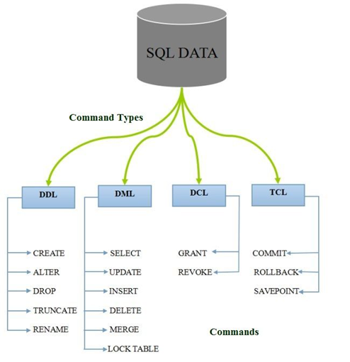

# Databaser - introduktion til SQL

## Beskrivelse
Vi skal nu til at gemme data i en database fremfor en hardkodet ArrayList eller tekstfil.
Vi skal i dag arbejde med en MySQL database, så det er vigtigt at du har - i det mindste forsøgt - at installere denne inden undervisning.  Det gælder også MySQL WorkBench, som er det værktøj vi skal bruge til at tilgå databasen. 

I bliver i dag introduceret til sproget SQL, specifikt DDL: Data Definition Language, og DML: Data Manipulation Language. DDL hanler om at definere strukturen af tabeller i databasen og DML handler om hvordan vi laver CRUD operationer på tabeller.
Dagen bliver en workshop med øvelser, så afprøv basisdelen i W3Schools introduktion til SQL inden undervisningen starter. Den behøver ingen installation på egen maskine.

## Forberedelse
Installér MySQL Server MySQL Community Server og MySQL WorkBench.  
[How to Download & Install MySQL on Windows 10/11 | Quick & Easy Tutorial](https://www.youtube.com/watch?v=AaISTiooIVU)  
NB! Det er vigtigt at du husker dit MySql root password, da det er meget besværligt at ændre, hvis du glemmer det. 

Se disse videoer:  
[SQL - Introduction - W3Schools.com](https://www.youtube.com/watch?v=zpnHsWOy0RY). Afprøv eksemplet i videoen her [The Try-SQL Editor](https://www.w3schools.com/sql/trysql.asp?filename=trysql_select_all)  


[SQL: DDL and DML Part 1 of 4: CREATE TABLE, Primary Keys and INSERT](https://www.youtube.com/watch?v=dVxd5z97878)  
[SQL: DDL and DML Part 2 of 4: ALTER TABLE, and CONSTRAINTs: Check, Unique, and Foreign Key](https://www.youtube.com/watch?v=hrwq_FFky30)  
[SQL: DDL and DML Part 3 of 4: INSERT, UPDATE, SELECT and DELETE](https://www.youtube.com/watch?v=ifNJ3KFcTUo)  
[SQL: DDL and DML Part 4 of 4: INFORMATION SCHEMA](https://www.youtube.com/watch?v=Yf_TMV0eIQc)  

Referencer:  
Arbejd med [W3Schools SQL Tutorial](https://www.w3schools.com/sql/) (til og med aliases) samt [SQL Databases](https://www.w3schools.com/sql/sql_create_db.asp)  
[SQL Course for Beginners [Full Course]](https://www.youtube.com/watch?v=7S_tz1z_5bA) til 1:24. Dette er mere et opslagsværk, se TOC i kommentarerne.  

## Læringsmål
- At kunne forklare hvad en database er
- At kunne oprette en database med tilhørende tabeller med SQL DDL.
- At kunne lave CRUD operationer på data i en database med SQl DML

## Indhold
# Introduktion til SQL  

## Hvad er SQL?  

**SQL** står for *Structured Query Language* og er det mest udbredte sprog til at arbejde med relationelle databaser.  
SQl er inddelt i emn række kommandikategoier med hver deres formål.    



### DDL – Data Definition Language
DDL er den del af SQL, der bruges til at definere og ændre databasestrukturen.
DDL ændrer altså strukturen – ikke indholdet.

#### CREATE
##### Opret database
En database oprettes med:  
```sql
CREATE SCHEMA products_db;
```
eller en nyere syntaks:  
```sql
CREATE DATABASE products_db;
```
Herefter vælges den aktive database:  
```sql
USE products_db;
```
##### Opret tabeller – CREATE TABLE
```sql
CREATE TABLE supplier (
    supplier_id INT,
    name VARCHAR(50),
    address VARCHAR(100),
    city VARCHAR(50),
    postal_code VARCHAR(10),
    country VARCHAR(50),
    phone VARCHAR(20),
    email VARCHAR(50),
    PRIMARY KEY (supplier_id)
);

CREATE TABLE product (
    id INT,
    price INT,
    name VARCHAR(30),
    description VARCHAR(255),
    supplier_id INT,
    PRIMARY KEY(id),
    FOREIGN KEY (supplier_id)
        REFERENCES supplier(supplier_id)
);
```

#### SQL Constraints (DDL)   
Eksempel med brug af flere constraints:  
```sql
CREATE TABLE employee (
    emp_id INT AUTO_INCREMENT,
    name VARCHAR(100) NOT NULL,
    email VARCHAR(100) UNIQUE,
    age INT CHECK (age >= 18),
    salary DECIMAL(10,2) DEFAULT 0,
    dept_id INT,
    PRIMARY KEY (emp_id),
    FOREIGN KEY (dept_id)
        REFERENCES department(dept_id)
);
 ```
| Constraint       | Formål                     | Hvad sikrer den?                    | Eksempel                                       |
| ---------------- | -------------------------- | ----------------------------------- | ---------------------------------------------- |
| `PRIMARY KEY`    | Unik identifikation        | Unik + NOT NULL                     | `PRIMARY KEY (id)`                             |
| `FOREIGN KEY`    | Relation mellem tabeller   | Referentiel integritet              | `FOREIGN KEY (deptno) REFERENCES dept(deptno)` |
| `NOT NULL`       | Felt må ikke være tomt     | Ingen NULL-værdier                  | `name VARCHAR(50) NOT NULL`                    |
| `UNIQUE`         | Unik værdi i kolonne       | Ingen dubletter                     | `UNIQUE (email)`                               |
| `CHECK`          | Regel for værdier          | Betingelse skal være opfyldt        | `CHECK (age >= 18)`                            |
| `DEFAULT`        | Standardværdi              | Automatisk værdi hvis intet angives | `DEFAULT 0`                                    |
| `AUTO_INCREMENT` | Automatisk genereret nøgle | Automatisk id                       | `id INT AUTO_INCREMENT`                        |


Databasen giver fejl hvis man forsøger at indsætte data hvor constraints ikke er overholdt.  

### DML – Data Manipulation Language
DML er den del af SQL, der bruges til at forespøge på data og ændre indholdet i databasen (CRUD operationer).

- **Hente data** fra en database (f.eks. finde alle kunder i København)  
- **Indsætte data** (f.eks. tilføje en ny ordre)  
- **Opdatere data** (f.eks. ændre en kundes telefonnummer)  
- **Slette data** (f.eks. slette en ordre)  

SQL fungerer på næsten alle relationelle databasesystemer (f.eks. MySQL, PostgreSQL, Oracle og SQL Server), og sproget er standardiseret, så grundlæggende kommandoer er ens på tværs af systemer.  

De mest centrale kommandoer i SQL kaldes ofte for **CRUD**:  
- **C**reate → `INSERT`  
- **R**ead → `SELECT`  
- **U**pdate → `UPDATE`  
- **D**elete → `DELETE`  

SQL er altså det værktøj, vi bruger til at kommunikere med databaser – på samme måde som vi bruger dansk eller engelsk til at kommunikere med hinanden.  

---

## Eksempel på en simpel forespørgsel  

Forestil dig, at vi har en tabel, der hedder `employees`, med oplysninger om medarbejdere:  

| empno | name     | job        | salary |
|-------|----------|------------|--------|
| 7369  | SMITH    | CLERK      | 800    |
| 7499  | ALLEN    | SALESMAN   | 1600   |
| 7521  | WARD     | SALESMAN   | 1250   |

Hvis vi vil hente alle oplysninger om medarbejderne, skriver vi:  

```sql
SELECT * 
FROM employees;
```
Hvis vi kun vil se navne og løn for dem, der tjener mere end 1300, skriver vi:  
```sql
SELECT name, salary
FROM employees
WHERE salary > 1300;
```
# SQL Cheat Sheet – de mest brugte kommandoer  

Dette cheat sheet giver et hurtigt overblik over de mest almindelige SQL-kommandoer.  

---

## 1. Hent data – `SELECT`  
```sql
-- Hent alle kolonner fra en tabel
SELECT * 
FROM employees;

-- Hent bestemte kolonner
SELECT name, salary 
FROM employees;

-- Hent ansatte med løn over 2000
SELECT name, salary 
FROM employees
WHERE salary > 2000;

-- Sorter resultater
SELECT name, salary 
FROM employees
ORDER BY salary DESC;
```
## 2. Indsæt data – INSERT
```sql
-- Indsæt en ny række i tabellen
INSERT INTO employees (empno, name, job, salary)
VALUES (7900, 'JENSEN', 'CLERK', 1500);
```
Hvis vi lader databasewn generere den prrimære nøgle med AUTO_INCREMET skal vi ikke indsætte denne.  
Eksempel:
```sql
CREATE TABLE product (
    id INT AUTO_INCREMENT,
    name VARCHAR(100) NOT NULL,
    price DECIMAL(10,2) NOT NULL,
    PRIMARY KEY (id)
);
```
- id genereres automatisk af databasen
- Man skal ikke angive id ved INSERT
- Databasen starter typisk ved 1 og tæller op

```sql
INSERT INTO product (name, price)
VALUES ('Microphone', 799.00);

INSERT INTO product (name, price)
VALUES ('Keyboard', 499.00);
```

## 3. Opdater data – UPDATE
```sql
-- Opdater løn for en bestemt medarbejder
UPDATE employees
SET salary = 1800
WHERE name = 'JENSEN';
```
## 4. Slet data – DELETE
```sql
-- Slet en medarbejder
DELETE FROM employees
WHERE name = 'JENSEN';
```

## 5. Aggregatfunktioner (arbejde med grupper af data)
```sql
-- Antal medarbejdere
SELECT COUNT(*) 
FROM employees;

-- Gennemsnitsløn i afdelingen
SELECT AVG(salary) 
FROM employees
WHERE deptno = 20;

-- Højeste løn
SELECT MAX(salary) 
FROM employees;
```
## Opsummering  
SELECT = Læs (Read)  
INSERT = Tilføj (Create)  
UPDATE = Ret (Update)  
DELETE = Fjern (Delete)  

## Aktiviteter  
I skal gennemføre eksemplerne i videoerne SQL: DDL and DML Part 1 of 4.  
Disse er lavet i MS SQl server og der er en række dialekt forskelle i forhold til MySql som vi bruger.  

Hvad skal ændres i forhold til videoens SQL Server-syntaks?

**GO fjernes**
- GO er en SQL Server batch-separator. MySQL Workbench bruger den ikke.

**IDENTITY → AUTO_INCREMENT**  
SQL Server:
```sql
id int IDENTITY not null
```  
MySQL:  
```sql
id INT NOT NULL AUTO_INCREMENT
```
**use spiffylube** virker, men du skal selv oprette databasen først **CREATE DATABASE** ... (eller DROP + CREATE for en ren start).


**Datoformat**  
I MySQL er '2021-01-28' det sikre format.
Undgå '1/28/2021', da det kan afhænge af serverindstillinger.

**Kommentarer**  
-- kommentar  

**Afslut sætninger med ';'**  
MySql sætninger afsluttes med ';'


