# SQL Joins

## Beskrivelse

Vi skal arbejde videre med lidt mere avancerede SQL SELECT statements. Dagens emner omfatter JOIN, 
som gør det muligt at arbejde på flere tabeller ad gangen, 
samt GROUP BY og HAVING, som bliver brugt til at aggregere pr kolonne. Desuden skal vi se på subqueries.

## Forberedelse

Se følgende videoer:

[SQL Joins: A Guide and Examples](https://youtu.be/UfgRTbRN9FM?si=gVz0KXmqdX842PvC)

[SQL Join 3 Tables: How-To with Example](https://youtu.be/TGt2xa7EzvI?si=jAJDnLCX_4vljRpT)

[SQL Group By: An Explanation and How To Use It](https://youtu.be/x2_mOJ3skSc?si=G02l9CtNsJdNy0JL)

[What is SQL HAVING and Why Use It?](https://youtu.be/ecjuQK2th24?si=gL4DAvKGU3B4GAui)

[When to Use a Subquery in SQL](https://youtu.be/tlvxb7UduJw?si=yY0G-xyfk-eJhj95)

---

## Læringsmål

- Kan bruge JOIN til at læse data fra mere end én tabel
- Kan bruge GROUP BY og HAVING
- Kan bruge subqueries

---

## Indhold

---

### Eksempel movie database

(Baseret på: [Build an IMDb Database with SQL](https://youtu.be/tA7IbUqioOQ?si=lj7WyuwzfCwI_Zbs) 
og konverteret fra PostgreSQL til MySQL)

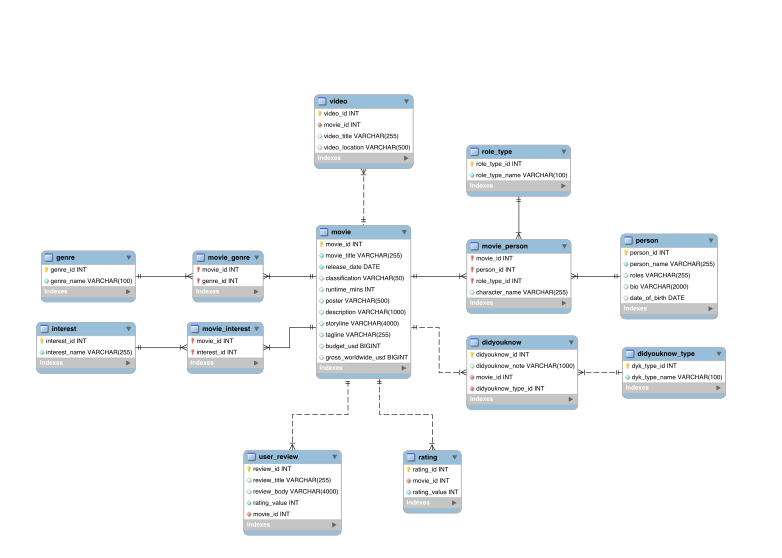

[Opgave: ER diagram](opgave_ERD_analyse.pdf)

[Opgave: DDL](opgave_movie_catalog_ddl.pdf)

---

## Joins

En JOIN forbinder data, der logisk hører sammen, men er gemt i forskellige tabeller. 

En JOIN er en operation, der sammensætter relaterede rækker fra flere tabeller ved hjælp af en fælles nøgle.

### Inner Join

En (INNER) JOIN returnerer kun de rækker, hvor der findes et match i begge tabeller.

(INNER) JOIN viser kun de data, der findes i begge tabeller ud fra join-betingelsen.


---

Hvordan finder man user ratings for en movie?

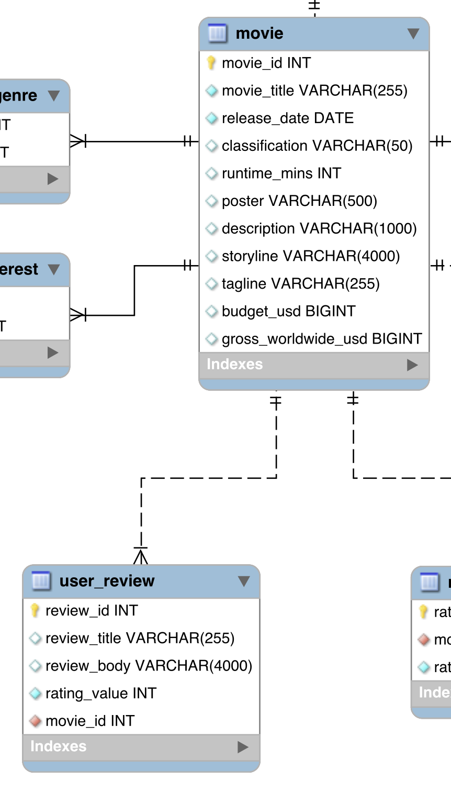

```mysql
SELECT movie_title, rating_value FROM movie
JOIN user_review ON movie.movie_id = user_review.movie_id;
```

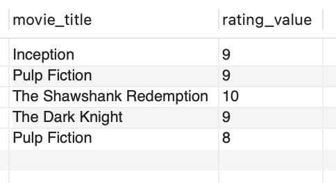

kan f.eks omdøb columns...

```mysql
SELECT movie_title AS Title, rating_value AS "User rating" FROM movie
JOIN user_review ON movie.movie_id = user_review.movie_id
ORDER BY movie_title;
```

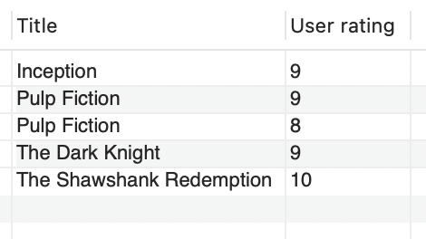

---

Med en inner join vises kun movies og user ratings hvor der er en match (movie_id) i begge tabeller.

Hvordan vises alle movies, uanset om der er en user rating dvs. en match?

---

### OUTER JOIN

En OUTER JOIN returnerer alle rækker fra den ene tabel – også selvom der ikke findes et match i den anden tabel.

En OUTER JOIN viser både matchende rækker og de rækker, der ikke har et match.

Der findes tre typer:
- LEFT OUTER JOIN: Alle rækker fra venstre tabel + matches fra højre.
- RIGHT OUTER JOIN: Alle rækker fra højre tabel + matches fra venstre.
- FULL OUTER JOIN: Alle rækker fra begge tabeller (også dem uden match).

Hvis der ikke findes et match, bliver kolonnerne fra den manglende side vist som NULL.

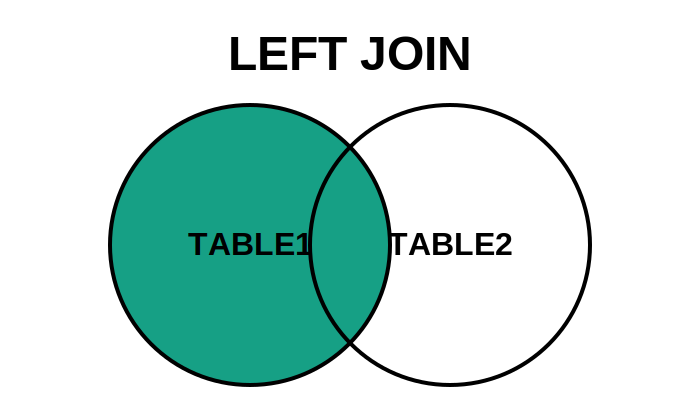

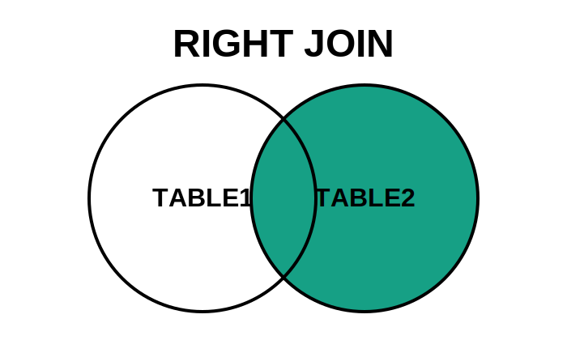

---

Hvordan vises alle movies, uanset om der er en user rating dvs. en match?

```mysql
SELECT movie_title, rating_value FROM movie
LEFT JOIN user_review ON movie.movie_id = user_review.movie_id;
```

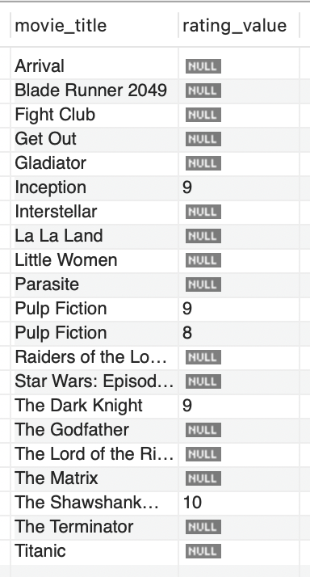

---

Hvordan får man en liste af movies og deres instruktører?

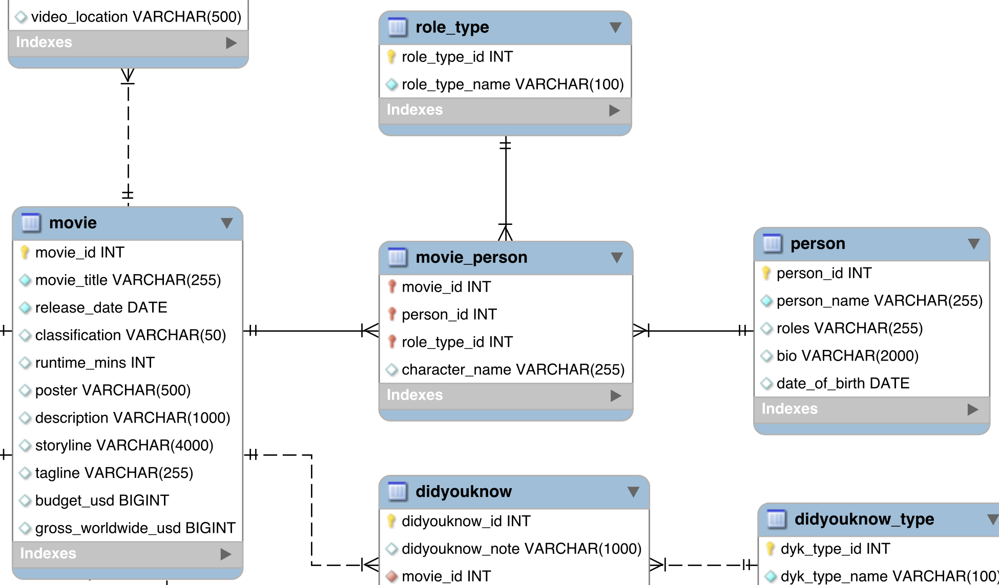

Kræver JOINs på mere end to tabeller


```mysql
SELECT movie.movie_title AS Movie, person.person_name AS Director
FROM movie_person
JOIN role_type
ON role_type.role_type_id = movie_person.role_type_id
AND role_type.role_type_name = "Director"
JOIN person
ON movie_person.person_id = person.person_id
JOIN movie
ON movie.movie_id = movie_person.movie_id;
```


---

[Opgave: Joins](opgave_movie_catalog_joins.pdf)

---

## GROUP BY

GROUP BY bruges til at samle rækker i grupper baseret på én eller flere kolonner.

GROUP BY opdeler data i grupper, så man kan lave beregninger (fx COUNT, SUM, AVG) pr. gruppe.

F.eks. Hvor mange user reviews har en film?

```mysql
SELECT movie_id, COUNT(*) AS reviews
FROM user_review
GROUP BY movie_id;
```

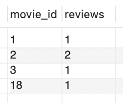

---

## HAVING

HAVING bruges til at filtrere grupper efter GROUP BY.

HAVING filtrerer på aggregater (fx COUNT, SUM), hvor WHERE kun filtrerer på enkelte rækker før gruppering.

F.eks. Hvilke film har mere en én user review?

```mysql
SELECT movie_id, COUNT(*) AS reviews
FROM user_review
GROUP BY movie_id
HAVING COUNT(*) > 1;
```

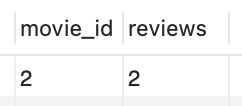

Hvis film titlen ønskes i stedet for movie_id skal der laves en (inner) join med movie tabellen:

```mysql
SELECT movie.movie_title AS title, COUNT(*) AS reviews
FROM user_review
JOIN movie
ON movie.movie_id = user_review.movie_id
GROUP BY user_review.movie_id, movie.movie_title;
```

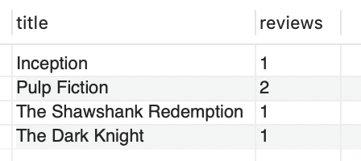


Hver column i SELECT skal enten:
- Være med i GROUP BY, eller
- Være omsluttet af en aggregatfunktion (fx COUNT, SUM, AVG osv.).

---

[Opgave: GROUP BY, HAVING](opgave_group_by_having)

---

### Subquery

En subquery er en SQL-forespørgsel inde i en anden forespørgsel.

En subquery bruges til at beregne et resultat, som den ydre forespørgsel derefter anvender.

Hvordan finder man movies som har en rating større end gennemsnittet?

```mysql
SELECT m.movie_title
FROM movie m
JOIN rating r ON r.movie_id = m.movie_id
WHERE r.rating_value > (
    SELECT AVG(rating_value)
    FROM rating
);
```

---

