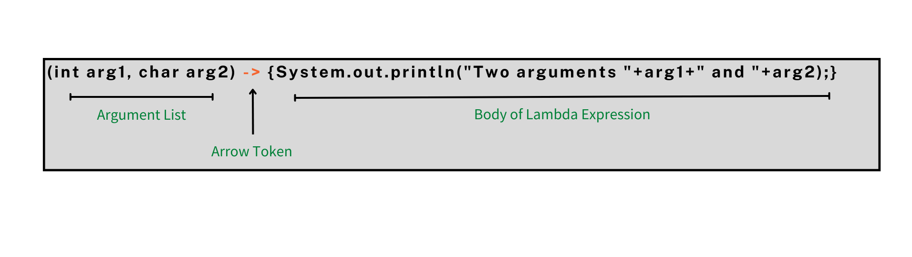
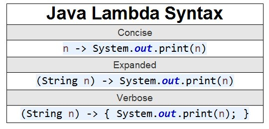

# Funktionelle interfaces, JdbcTemplate og Spring 2

## Beskrivelse

Vi skal arbejde videre med JdbcTemplate og Springboot. I den forbindelse skal vi se nærmere på funktionelle interfaces, og hvordan de bruges i Spring-biblioteket. 
## Forberedelse

Se denne video om [Funktionelle interfaces](https://www.youtube.com/watch?v=5D6LPl1NsbI)

Kig på dokumentationen for [JdbcTemplate](https://docs.spring.io/spring-framework/docs/current/javadoc-api/org/springframework/jdbc/core/JdbcTemplate.html)
## Læringsmål
- Kan forklare hvad et funktionelt interface er, og hvordan det optræder i Spring.
- Kan bruge JdbcTemplate (fortsat)
- Kan forstå og forklare andre centrale biblioteksklasser og metoder der er involveret i at få forbindelsen mellem Springboot og databasen til at virke

## Indhold

Funktionelle interfaces bruges flere steder i de biblioteker der hører til Springboot.

De bruges sammen med lambda-udtryk, som I muligvis er stødt ind i på 1. semester. Det er vigtigt at forstå dem for at kunne læse kode som andre har skrevet (eller AI har givet jer), og selvfølgelig for at  kunne skrive dem selv.

Strukturen i et lambda-udtryk er 

### Regler for lambda-udtryk

 - Optional type declaration — we don't need to declare the types of the parameters on the left-hand side of the lambda because the compiler can infer them from their values. As a result, int param ->... and param ->... are both legal.

 - Optional parentheses - we don't need to use parenthesis when only one parameter is declared. This indicates that param ->... and (param) ->... are both legal, but parentheses are necessary when more than one parameter is provided.

 - Optional curly braces – Curly braces are not required when the expressions component contains only one statement. This indicates that param – > statement and param – > statement; are both legitimate options, but curly brackets are required when several statements are present.

 - Optional return statement – We don't require a return statement if the expression returns a value and is enclosed in curly braces. As a result, both (a, b) – > return a+b; and (a, b) – > a+b; are correct.

## Aktiviteter

[Opgave 1 - funktionelle interfaces, videoens eksempel](opgave_functional_interfaces.md)

[Opgave 2 - funktionelle interfaces, Comparator](opgave_functional_interface_comparator.md)

   

