### Create a MySQL Database Server on Azure

This guide describes how to create a MySQL database server on Microsoft's Azure cloud platform.

Log in to the [Azure portal](https://portal.azure.com/#home).
This requires a (student) account on Azure. If an account has not been created, follow the instructions here:
[Azure for Students for free](https://azure.microsoft.com/en-gb/free/students) and use your EK student mail.

1. From the home screen choose Create a resource.

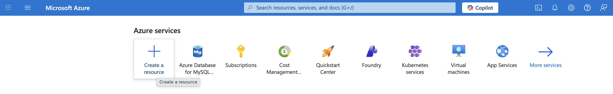

1. From the home screen choose Create a resource.

2. Under Categories select Databases.

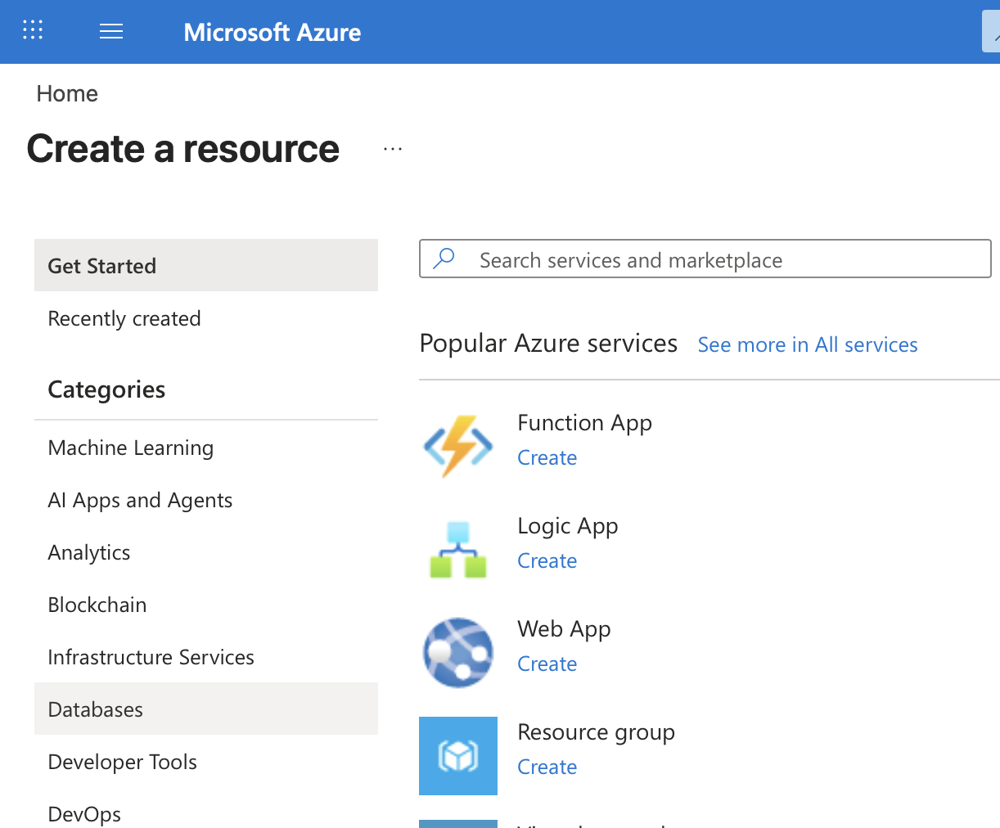

3. Under Databases, Select Azure Database for MySQL Flexible Server

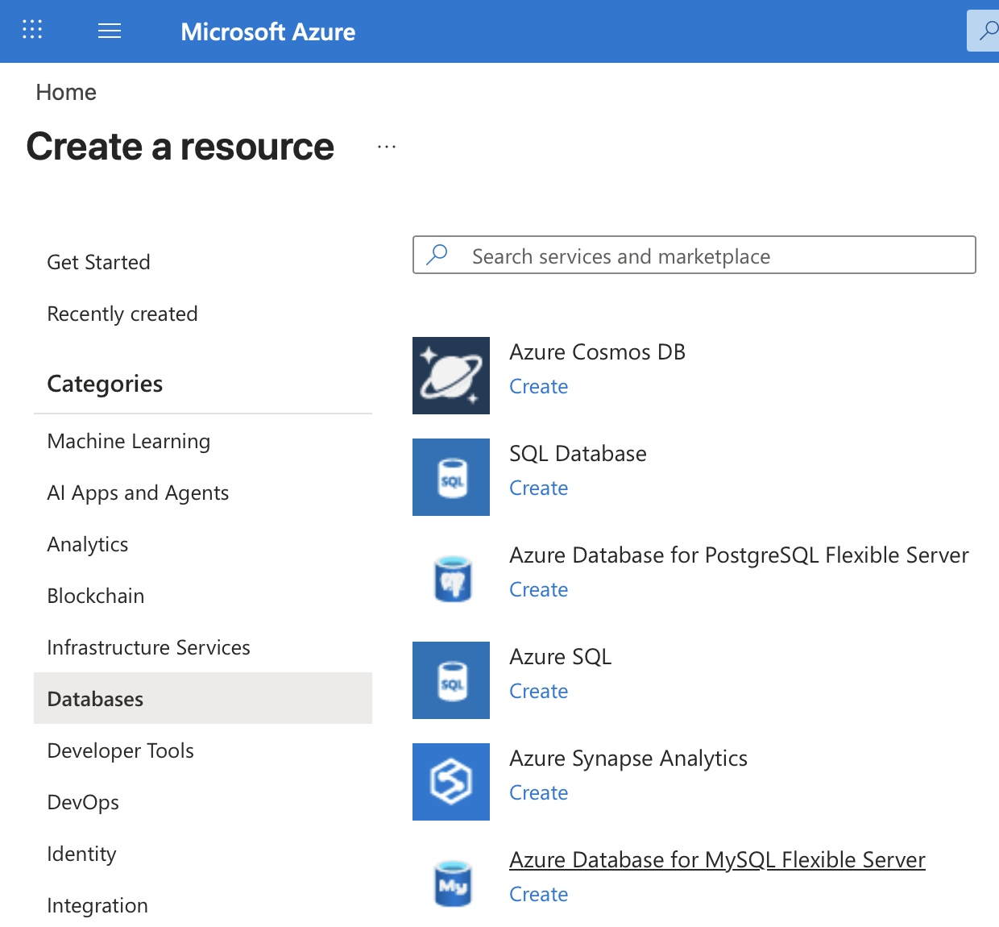

4. Under Flexible Server, choose Advanced Create.

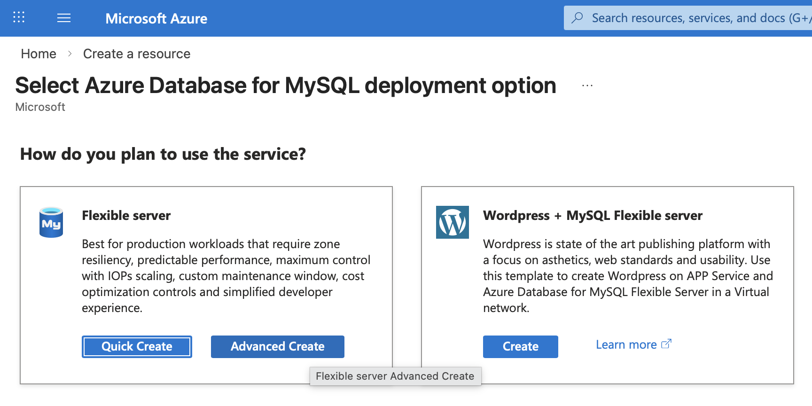

5. Under Project details, choose your subscription. Create a new resource group e.g. rg-world

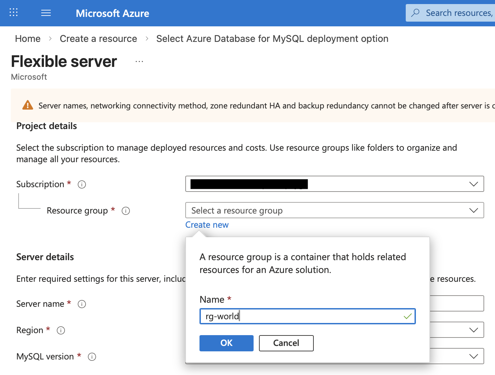

6. Set the Server details as shown. Here, North Europe is chosen as the Region. 

NB. In the Azure Free Plan Subscription, only a limited number of regions are allowed. 
 The regions can be seen by in Policy | Authoring | Assignments | Allowed resource deployment regions

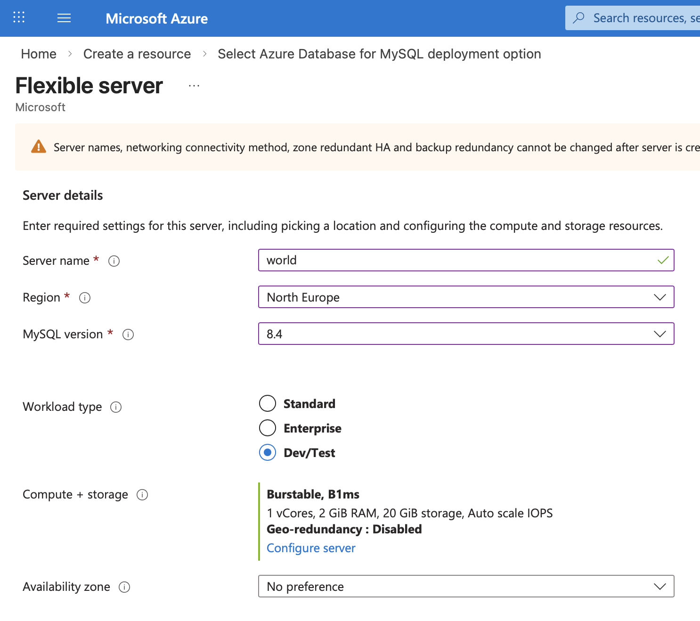

7. Set the Authentication details as shown. Remember the Administrator login and Password. Select Next: Networking >

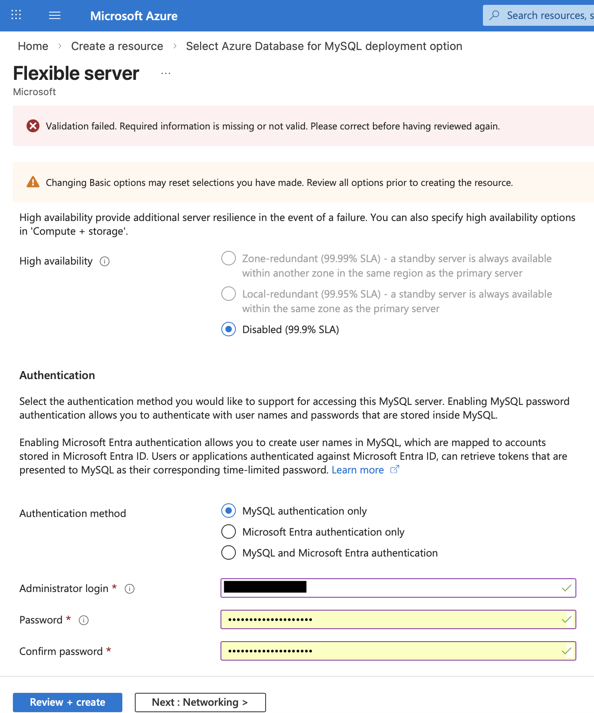

8. Set the Network connectivity as shown. Under Firewall rules, select + Add current client IP address. 
The firewall rule must be updated when a new client IP address is used e.g. at home or at school. 
Select Review and create.

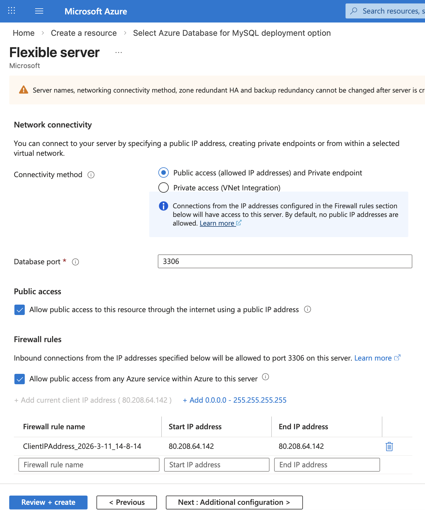

9. Select Create. After a short period (several minutes), the resources will be created.

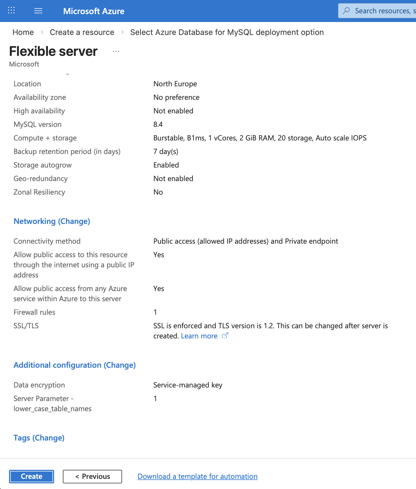

10. Select Go to resource

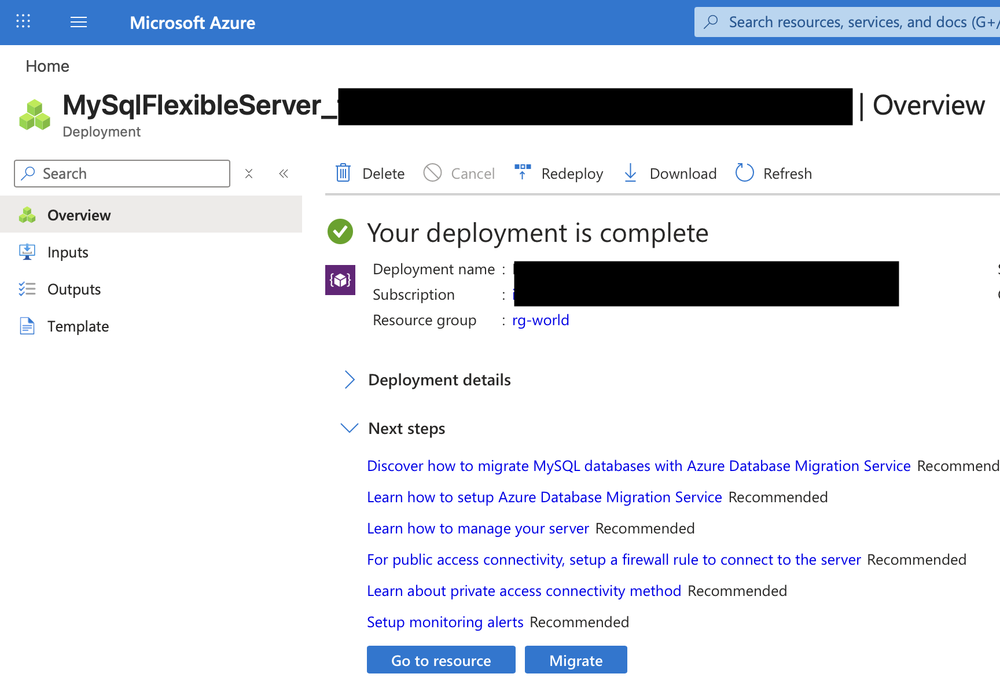

11. Note the endpoint.

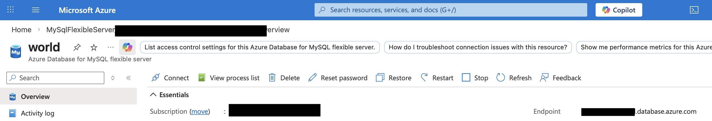

12. The deployed database server can now be accessed by creating a connection in e.g. MySQL Workbench.

 **NB. When the database is no longer required, delete all the resources on Azure. 
 This will prevent credits being used unnecessarily.
 A stopped database server restarts automatically after 30 days.**

