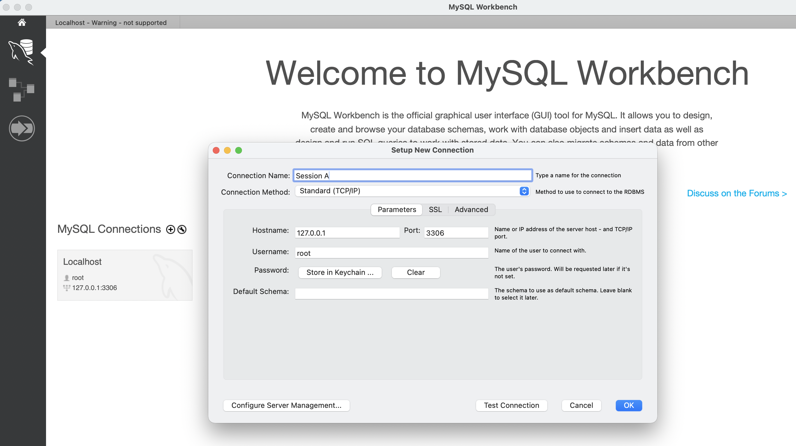
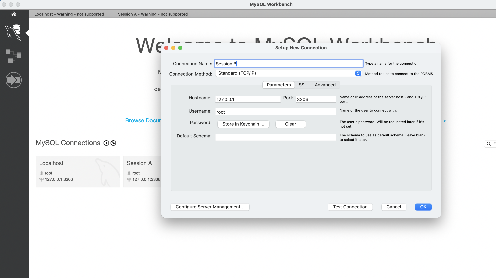

### Opgave SQL Transactions

Formålet med opgaven er at illustrere transactions i SQL herunder commit og rollback, samt transaction isolation.

### Opsætning

1. I MySQLWorkbench kør scriptene bank_schema.sql og bank_data.sql som findes i sql mappen.
2. Kontroller indholdet af account tabellen.
3. Opret en ny forbindelsen (connection) til den lokale MySQL server og navngiv som "Session A".

4. Opret en anden ny forbindelsen (connection) til den lokale MySQL server og navngiv som "Session B".

### Opgave 1. COMMIT
Følgende SQL kommandoer skal eksekveres i rækkefølgen og i den MySQL server forbindelsen
som angivede i tabellen dvs. 1. `SELECT * FROM account;` i Session A 
og så 2. `SELECT * FROM account;` i Session B og så videre.

Efter hver kommando skal resultatet skrives ned og forklares.

| Step | Session A (Transaction)                                               | Session B (Observer)        |
|------|-----------------------------------------------------------------------|-----------------------------|
| 1    | SELECT * FROM user_account;                                           |                             | 
| 2    |                                                                       | SELECT * FROM user_account; | 
| 3    | START TRANSACTION;                                                    | | 
| 4    | UPDATE user_account SET balance = balance - 100 WHERE account_id = 1; | | 
| 5    | SELECT * FROM user_account;                                           |                             | 
| 6    |                                                                       | SELECT * FROM user_account; | 
| 4    | UPDATE user_account SET balance = balance + 100 WHERE account_id = 2; || 
| 5    | SELECT * FROM user_account;                                           |                             | 
| 6    |                                                                       | SELECT * FROM user_account; | 
| 7    | COMMIT;                                                               |                             | 
| 8    | SELECT * FROM user_account;                                           |                             | 
| 9    |                                                                       | SELECT * FROM user_account; | 

### Opgave 2. ROLLBACK
Følgende SQL kommandoer skal eksekveres i rækkefølgen og i den MySQL server forbindelsen
som angivede i tabellen dvs. 1. `SELECT * FROM account;` i Session A
og så 2. `SELECT * FROM account;` i Session B og så videre.

Efter hver kommando skal resultatet skrives ned og forklares.

| Step | Session A (Transaction)                                               | Session B (Observer)        |
|------|-----------------------------------------------------------------------|-----------------------------|
| 1    | SELECT * FROM user_account;                                           |                             | 
| 2    |                                                                       | SELECT * FROM user_account; | 
| 3    | START TRANSACTION;                                                    | | 
| 4    | UPDATE user_account SET balance = balance - 100 WHERE account_id = 1; | | 
| 5    | SELECT * FROM user_account;                                           |                             | 
| 6    |                                                                       | SELECT * FROM user_account; | 
| 4    | UPDATE user_account SET balance = balance + 100 WHERE account_id = 2; || 
| 5    | SELECT * FROM user_account;                                           |                             | 
| 6    |                                                                       | SELECT * FROM user_account; | 
| 7    | ROLLBACK;                                                             |                             | 
| 8    | SELECT * FROM user_account;                                           |                             | 
| 9    |                                                                       | SELECT * FROM user_account; | 
