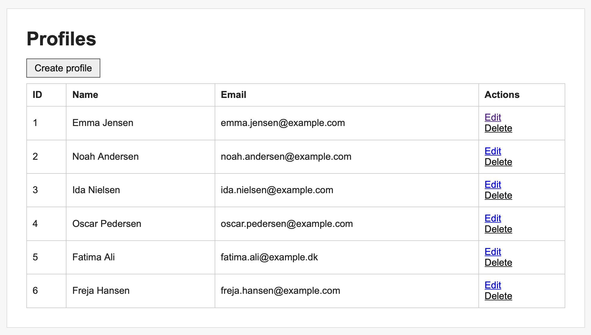
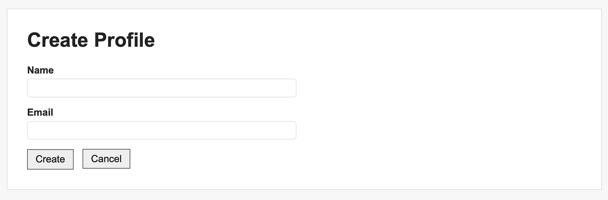

# Fejlhåndtering i Spring Boot

## Vi implementerer best practices for fejlhåndtering i vores Spring Boot applikation

## Forberedelse

Læs: [Handle Exceptions in Spring Boot: A Guide to Clean Code Principles](https://medium.com/@sharmapraveen91/handle-exceptions-in-spring-boot-a-guide-to-clean-code-principles-e8a9d56cafe8)

---

## Læringsmål

- at kunne implementere fejlhåndtering i en Spring Boot applikation
- at kunne anvende best practices for fejlhåndtering i en Spring Boot applikation
- at kunne anvende globale og lokale fejlhåndteringsmekanismer i Spring Boot

---

## Indhold

- best practice
- custom exceptions
- @ControllerAdvice, @ExceptionHandler, @ResponseStatus
- custom error pages

---

### Fejlhåndtering i Spring Boot

---

### Hvad kan gå galt?

Eksempel CRUD applikation:


<br>



---

### Hvordan skal det håndteres og hvor?

**Controller** håndterer fejl brugeren kan rette (validering, dubletter).

**Service** oversætter lave system- og databasefejl til domænespecifikke custom exceptions.

**GlobalExceptionHandler** håndterer tværgående fejl som kan opstå i flere controllere (404, 500).

**Spring Boot** håndterer resterende fejl via det centrale /error-endpoint.

---

### Controller level håndtering

Controller-level fejlhåndtering bruges primært til forventede brugerfejl 
som f.eks. ugyldigt input eller manglende felter og er fejl som brugeren kan rette.

Det samme view returneres ofte.


Exceptions kastes i service klassen og håndteres i controller klassen.

I controller klassen:

```java
    @PostMapping
    public String create(@ModelAttribute Profile profile, Model model) {
        try {
            profileService.create(profile);
            return "redirect:/exprofiles";
        } catch (InvalidProfileException | DuplicateProfileException ex) {
            model.addAttribute("profile", profile);
            model.addAttribute("formTitle", "Create Profile");
            model.addAttribute("formAction", "/exprofiles");
            model.addAttribute("submitLabel", "Create");
            model.addAttribute("errorMessage", ex.getMessage());
            return "profiles/profile-form";
        }
    }
```

og i service klassen:

```java
    public Profile create(Profile profile) {
        validateProfile(profile);
        try {
            return profileRepository.insert(profile);
        } catch (DataIntegrityViolationException ex) {
            throw new DuplicateProfileException("Name or email already exists.");
        } catch (DataAccessException ex) {
            throw new DatabaseOperationException("Failed to create profile.", ex);
        }
    }
```

---

Server-side validering (Controller og GlobalExceptionHandler) er nødvendig for korrekthed og sikkerhed.

Client-side validering skal også implementeres til at forhindre unødvendige forespørgsler forbedre brugeroplevelsen (UX)

f.eks.
```html
<label for="email">Email</label>
<input id="email" type="email" required th:field="*{email}" maxlength="100">
```

---

### Global Fejlhåndtering med ```@ControllerAdvice```

En GlobalExceptionHandler er en klasse annoteret med: ```@ControllerAdvice```
som bruges til at håndtere exceptions centralt for hele applikationen i stedet for i hver enkelt controller.

Formålet er at sikre ensartet og central håndtering af fejl, som kan opstå på tværs af flere controllere.

Når en exception bliver kastet i en controller (eller i service-laget kaldt fra controlleren):
1.	Spring forsøger først at finde lokal håndtering (i controlleren)
2.	Hvis ikke fundet, søger den i @ControllerAdvice annoteret klassen efter en metode 
som er annoteret med ```@ExceptionHandler``` og den matchende exception-type. @ResponseStatus angiver hvad
http responsen skal være f.eks.

```java
@ControllerAdvice
public class GlobalExceptionHandler {

    @ExceptionHandler(ProfileNotFoundException.class)
    @ResponseStatus(HttpStatus.NOT_FOUND)
    public String handleProfileNotFound(ProfileNotFoundException ex, Model model) {

```

3. Hvis Spring ikke finder en passende ```@ExceptionHandler```, bliver fejlen sendt videre til Spring Boot’s centrale fejlmekanisme via /error.

___

### Custom Error Pages

Spring Boot har en indbygget fejlmekanisme som automatisk håndterer alle fejl og exceptions i web-laget.


Når en fejl opstår (f.eks. 404 eller 500), forsøger Spring Boot at finde en passende HTML-skabelon
og vise den i stedet for den indbyggede Whitelabel Error Page.


Spring Boot leder automatisk efter filer i følgende rækkefølge:
1.	/templates/error/<status>.html (fx error/404.html)
2.	/templates/error.html (generisk fallback)
3.	Hvis ingen findes → vises den indbyggede Whitelabel Error Page (medmindre slået fra).


For at oprette brugerdefinerede fejlsider, skal HTML-filerne i følgende mapper:
```text
src/
└── main/
    └── resources/
        └── templates/
            └── error/
                ├── 404.html
                ├── 500.html
            └── error.html
```

___

### Custom Exceptions

Ved at implementere custom exceptions (som nedarver fra fx RuntimeException)
kan man skabe mere meningsfulde fejlmeddelelser og håndtere specifikke fejlscenarier i en applikation.

```java
public class ProfileNotFoundException extends RuntimeException {
    public ProfileNotFoundException(int id) {
        super("Profile with id " + id + " was not found.");
    }
}
```

---

### [Opgave: Fejlhåndtering i Spring Boot](opgave_fejlhåndtering.md)


---
