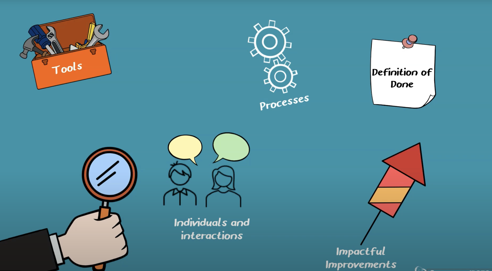

# Afslutning Wishlist-projekt: eksamenstræning & retrospective

## Beskrivelse

Vi afslutter Wishlist projektet med formative feedback kombineret med en demonstration af Wishlist applikationen
samt træning i gennemgang af koden.

Der gennemføres også en sprint retrospective samt et kode review af en anden gruppes løsning.

Vi starter med at kigge på kriterier for kode reviewet og proceduren.

Vi mødes allesammen på fredag - uanset tidspunkt for demo/tilbagemeldinger.

---

## Forberedelse

Læs:

Proceduren Wishlist demonstration og kode gennemgang: [Wishlist demo](wishlist-afslutning-tidsplan.pdf)

Læs:

[The Sprint Retrospective](https://www.scrum.org/learning-series/sprint-retrospective/introduction-to-the-sprint-retrospective-)

Se videoen:

[How to Facilitate the Sprint Retrospective](https://www.scrum.org/resources/how-facilitate-sprint-retrospective)

---

## Læringsmål

- At kunne gennemføre en detaljeret kode gennemgang
- At kunne vurdere kode kvalitet

---

## Indhold

---

### Demonstration og kode gennemgang
Proceduren og tidsplanen for Wishlist afslutning findes her: [Wishlist afslutning](wishlist-afslutning-tidsplan.pdf)

---

### The Scrum Guide on the Sprint Retrospective

*"The purpose of the Sprint Retrospective is to plan ways to increase quality and effectiveness.*

*The Scrum Team inspects how the last Sprint went with regards to individuals, interactions, processes, tools, 
and their Definition of Done. Inspected elements often vary with the domain of work. 
Assumptions that led them astray are identified and their origins explored. 
The Scrum Team discusses what went well during the Sprint, what problems it encountered, and how those problems were (or were not) solved.*

*The Scrum Team identifies the most helpful changes to improve its effectiveness. The most impactful improvements are addressed as soon as possible. They may even be added to the Sprint Backlog for the next Sprint.*

*The Sprint Retrospective concludes the Sprint. It is timeboxed to a maximum of three hours for a one-month Sprint. 
For shorter Sprints, the event is usually shorter."*

---

### Sprint Retrospective

&copy; Scrum.org

---
